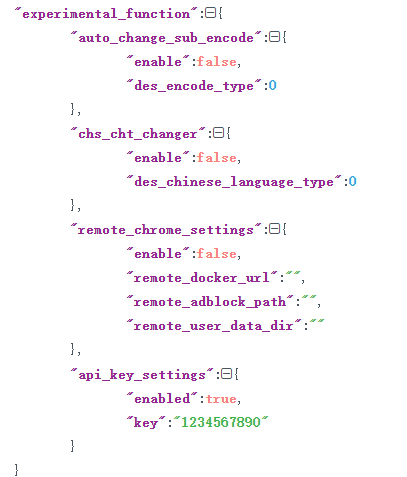

# API KEY 接口设计

目标是提供本程序的外部字幕下载和控制接口，这样用户可以自己做外部程序的对接。

> 这里我就假定你们的视频文件存储是符合以下两个文档的要求的
>
>  * 推荐的电影目录结构：见[文档](https://github.com/allanpk716/ChineseSubFinder/blob/docs/DesignFile/%E7%94%B5%E5%BD%B1%E7%9A%84%E6%8E%A8%E8%8D%90%E7%9B%AE%E5%BD%95%E7%BB%93%E6%9E%84.md)
>
>  * 推荐的连续剧目录结构：见[文档](https://github.com/allanpk716/ChineseSubFinder/blob/docs/DesignFile/%E8%BF%9E%E7%BB%AD%E5%89%A7%E7%9B%AE%E5%BD%95%E7%BB%93%E6%9E%84%E8%A6%81%E6%B1%82.md)

> 再次强调，一定要先削刮好了，再调用 API 添加任务哈，不然效果肯定不好

## 如何设置 API KEY

本程序的目录下（Windows 的当前程序目录，Linux 是 config 中），修改 `ChineseSubFinderSettings.json` 文件，新增内容，`api_key_settings`



## 接口认证方式

接口认证通过HTTP头`Authorization: Bearer <token>`传递，token 或者交 API KEY 请在 Web 界面设置，或者你也可以去直接修改配置文件中对应的字段。

## V1 接口

完整的推送接口需要加上前缀 "/api/v1"，举例 `/api/v1/add-job`

### 新增一个任务

新增一个视频的字幕下载任务

> 优先会去获取这个电影或者对应这个剧集的 IMDB ID 信息，如果获取不到，尝试从文件名解析出电影的名称，或者是连续剧一集的 SXXEXX 信息继续搜索。如果名称都控制不了，或者说不规范，那么搜索下载不到，我是没得办法的。所以再次强调**削刮**的重要性。
>
> 如果你传入的是连续剧，请看上面的文档要求，连续剧是目录结构需要是什么样子的，不然大概率也搜索不了。因为很简单，为了维护简单，连续剧一集的搜索也是从一季去搜索的，也就是我需要从你提交的视频文件的绝对路径的推算获取这个连续剧的 IMDB 信息。
>
> 现在第二选择是提取文件名搜索，前提永远是削刮后的命名，因为解析文件名的库是使用第三方的，需要考虑支持多少变态的命名格式这件事情源头上我是拒绝的。还是那个问题，之前的下载字幕的工具就是在这里吃亏（明显是足够用，也可以好用的，就是妥协这点坑了），用户文件名千奇百怪，解析文件名是一个长期积累的过程，本工具源头上就不想去踩坑。

> 嗨，还是得提一下。
>
> 有什么需求欢迎提，但是，如果我给出了不想实现的理由，你给的理由说服不了我，并且我坚持我自己的想法，这件事就别想着说服我了，你觉得你对，那你就是对。你想怎么做是你的事，我的工具有我的设计边界。互相要有个底线。

POST        /add-job

请求参数：

```json
{
    "video_type": 0, // 0 是 movie or 1 是 series，别传错哈，不然会触发不对的下载逻辑
    "physical_video_file_full_path": "xxx", // 这里传递的时候，是本程序中视频文件的物理路径
    "task_priority_level": 3, // 一般的队列等级是5，如果想要快，那么可以先默认这里填写3，这样就可以插队。如果是 0 ，那么就是一次性的任务(下载完一次就会删除)！
    "media_server_inside_video_id": "xxxx" //媒体服务器内部视频ID，可以用于自动 Emby 字幕列表刷新用，如果你是其他的媒体服务器，就别传，留空，我还没实现其他媒体服务器的接口
}
```

返回 HTTP 码 200：

```json
{
    job_id: "xxx",	// 这个任务的 ID，由服务器计算出来的
	message: "job is already in queue"
}
```

```json
{
	message: "physical video file not found"
}
```

```json
{
    job_id: "xxx",
	message: "ok"
}
```

### 获取任务状态

获取指定任务的状态

GET   /job-status

请求参数：

```json
?job_id=xxx // 任务的 ID
```

```go
const (
	Waiting     JobStatus = iota // 0任务正在等待处理
	Committed                    // 1任务已经提交，这个可能是提交给服务器，然后等待查询下载 Local 的本地任务不会使用这个标注位
	Failed                       // 2任务失败了，在允许的范围内依然会允许重试
	Done                         // 3任务完成
	Downloading                  // 4任务正在下载
	Ignore                       // 5任务被忽略，会存在于任务列表，但是不下载
)
```

返回 HTTP 码 200：

```json
{
    job_id: "xxx",
    job_status: 0, // Waiting、Failed、Done、Downloading、Ignore 可能出现的是这几种情况，注意是对应的 int 值
	message: "ok"
}
```

```json
{
    job_id: "xxx",
	message: "job not found"
}
```

```json
{
	message: "job_id is empty"
}
```

### 设置任务状态

设置指定任务的状态（我个人的建议是由本程序去管理任务的生命周期，也就是删除靠本程序来完成，不然，嗨~就是我懒得再记录一个删除的列表，还得需要多界面以及添加的时候还得交叉排除）

POST   /change-job-status

请求参数：

```json
{
	"id": "xxx", // 任务的 ID
    "task_priority": "high", // 任务的优先级，high or middle or low priority
    "job_status": 0, // 任务的状态 允许设置 Waiting(0) or Ignore(5)
}
```

```go
const (
	Waiting     JobStatus = iota // 0任务正在等待处理
	Committed                    // 1任务已经提交，这个可能是提交给服务器，然后等待查询下载 Local 的本地任务不会使用这个标注位
	Failed                       // 2任务失败了，在允许的范围内依然会允许重试
	Done                         // 3任务完成
	Downloading                  // 4任务正在下载
	Ignore                       // 5任务被忽略，会存在于任务列表，但是不下载
)
```

返回 HTTP 码 200：

```json
{
	message: "update job status failed"
}
```

```json
{
	message: "ok"
}
```

### 反馈视频已经观看

反馈某个视频已经观看，且使用的是那个字幕。如果这个视频文件已经标记过一次，再次触发这个接口会尝试更新 sub name 字段。

POST   /add-video-played-info

请求参数：

```json
{
    "physical_video_file_full_path": "xxx", // 这里传递的时候，是本程序中视频文件的物理路径
    "sub_name": "绝命毒师 S04E03.srt" // 这里传递的是这个字幕的名称，不要传递全路径
}
```

返回 HTTP 码 200：

```json
{
	message: "ok"
}
```

```json
{
	message: "physical video file not found"
}
```

```json
{
	message: "sub file not found"
}
```

### 删除反馈视频已经观看标记

删除反馈视频已经观看标记

DELETE   /del-video-played-info

请求参数：

```json
{
    "physical_video_file_full_path": "xxx" // 这里传递的时候，是本程序中视频文件的物理路径
}
```

返回 HTTP 码 200：

```json
{
	message: "ok"
}
```

```json
{
	message: "physical video file not found"
}
```


## 通用错误码

### 401

API KEY 不对

### 404

请求内容不存在

### 400

参数验证错误

返回错误信息：

```javascript
{
  message: '代理URL不能为空';
}
```

### 500

其他意外情况导致的错误

```javascript
{
  message: 'xxx';
}
```