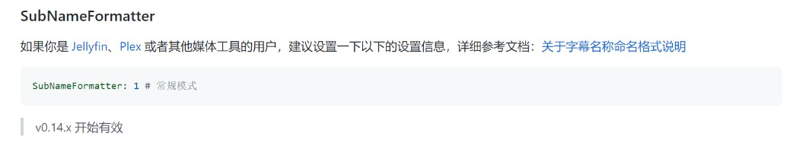

# Jellyfin、Plex 用户的设置建议

本程序描述了是支持 Jellyfin、Plex 的，但是仅仅是支持字幕保存的命名格式，API 接口这块暂时是没有对接的。

相关讨论见：

* [关于Jellyfin支持的问题 · Issue #100 · allanpk716/ChineseSubFinder (github.com)](https://github.com/allanpk716/ChineseSubFinder/issues/100)

## 推荐设置

### 字幕命名格式的设置

首先建议你看，[配置建议以及解释](https://github.com/allanpk716/ChineseSubFinder/blob/docs/DesignFile/%E9%85%8D%E7%BD%AE%E5%BB%BA%E8%AE%AE%E4%BB%A5%E5%8F%8A%E8%A7%A3%E9%87%8A.md) 这个文档。里面有一个是需要设置对的，否则 Jellyfin、Plex 加载、识别字幕会有问题。

这个设置是调整为常见的字幕命名格式，具体见文档，[关于字幕名称命名格式说明](https://github.com/allanpk716/ChineseSubFinder/blob/docs/DesignFile/%E5%85%B3%E4%BA%8E%E5%AD%97%E5%B9%95%E5%90%8D%E7%A7%B0%E5%91%BD%E5%90%8D%E6%A0%BC%E5%BC%8F%E8%AF%B4%E6%98%8E.md)

如果你开始忘记设置这个了，也没关系的。你先关闭本程序，修改这个设置，然后再次启动本程序，它是会自动去帮你把所有的字幕进行命名格式的改名的（但是，首先这个字幕的格式是要本程序支持的，不是随便的字幕都会帮改名，具体见文档。同时注意，这个速度快慢取决于你有多少字幕和机器的性能，耐心的等即可，这也是本程序的目标，就是你只用挂机，其他的不出问题无需关注）。

### API 功能的对接

这个目前都没有做，但是是有计划的。主要是花时间去评估是否 API 的功能足够用。

对接 API 主要是为了以下几点：

* 可以获取近期加入媒体库的媒体列表
* 获取媒体是否被播放过的标记
* 获取媒体选择播放的字幕是哪一个
* 刷新媒体库（下载字幕后需要能够让本程序去主动调用刷新的接口）

如果不满足这上面几点功能，可能就不太想对接，因为对接了没有正向优化和改进效率，以及为后续功能服务。

以及最上面提及的讨论，如果 API 设计的一塌糊涂，也不想对接。
