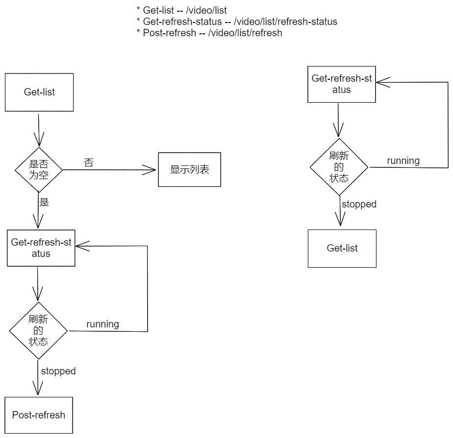

## 界面流程设计

目前有两个主要的流程


## Settings JSON 数据结构

```json
{
	"user_info": {
		"username": "abcd",
		"password": "123456"
	},
	"common_settings": {
        "interval_or_assign_or_custom": 0,// 0 是 固定间隔，1 是指定时间点，2 是符合 cron 的自定义规则
		"scan_interval": "12h",// 由前端给用户选择时间间隔，验证传递过来 https://pkg.go.dev/github.com/robfig/cron/v3
		"threads": 12,
		"run_scan_at_start_up": true,
		"movie_paths": ["aaa", "bbb"],
		"series_paths": ["ccc", "ddd"]
	},
	"advanced_settings": {
		"proxy_settings": {
			"use_http_proxy": true,
			"http_proxy_address": "123"
		},
		"debug_mode": true,
		"save_full_season_tmp_subtitles": true,
		"sub_type_priority": 1,
		"sub_name_formatter": 1,
		"save_multi_sub": true,
		"custom_video_exts": ["aaa", "bbb"],
		"fix_time_line": true,
		"topic": 0,
         "suppliers_settings": {
                "xunlei":	{
                    "name": "xunlei",
                    "root_url": "xxx",
                    "daily_download_limit": -1
                },
                 "shooter":	{
                    "name": "shooter",
                    "root_url": "xxx",
                    "daily_download_limit": -1
                },
                 "subhd":	{
                    "name": "subhd",
                    "root_url": "xxx",
                    "daily_download_limit": -1
                },
                 "zimuku":	{
                    "name": "zimuku",
                    "root_url": "xxx",
                    "daily_download_limit": -1
                },
            }
	},
	"emby_settings": {
		"enable": true,
		"address_url": "123456",
		"api_key": "api123",
		"max_request_video_number": 1000,
		"skip_watched": true,
		"movie_paths_mapping": {
			"aa": "123",
			"bb": "456"
		},
		"series_paths_mapping": {
			"aab": "123",
			"bbc": "456"
		}
	},
	"developer_settings": {
		"bark_server_address": "bark"
	},
	"timeline_fixer_settings": null,
    	"experimental_function": {
            "auto_change_sub_encode": {
                "enable": false,
                "des_encode_type": 0, // 默认 0 是 UTF-8，1 是 GBK
            },
           "chs_cht_changer": {
               "enable": false,
                "des_chinese_language_type": 0, // 默认 0 是 简体，1 是 繁体
           },
           "remote_chrome_settings": {
               "enable": false,
                "remote_docker_url": "ws://192.168.50.135:9222", // 这个是 go-rod 的远程镜像容器地址 ws://192.168.50.135:9222
               "remote_adblock_path": "/mnt/share/adblock1_2_3", // 注意这个 go-rod 的远程镜像容器对应的目录， ADBlock 需要展开成文件夹 /mnt/share/adblock1_2_3
               "remote_user_data_dir": "/mnt/share/tmp", // 注意这个 go-rod 的远程镜像容器对应的目录，用户缓存文件地址
           }
	}
}
```


## 接口认证方式

接口认证通过HTTP头`Authorization: Bearer <token>`传递

## API 列表

`content-type`均为`application/json`

### 获取系统的状态

`Get /system-status`

获取系统是否已经做过初始化，如果做过初始化就可以直接开始登录流程

请求参数：无

返回 HTTP 码200：

```js
{
  version: '0.0.1', // 版本号
  is_setup: false, // 系统是否已经初始化完成，true或false
}
```


### 应用初始化安装

`POST /setup`

无需权限认证，只在首次安装时有效，用于用户第一次安装程序时的引导页面。提交的时候务必要全部字段信息都填写。

> 注意，这里需要填写账号和密码的信息

请求参数：

```json
{
	"settings": {
        "user_info": {
            "username": "abcd",
            "password": "123456"
        },
        "common_settings": {
            "scan_interval": "12h",
            "threads": 12,
            "run_scan_at_start_up": true,
            "movie_paths": ["aaa", "bbb"],
            "series_paths": ["ccc", "ddd"]
        },
        "advanced_settings": {
            "proxy_settings": {
                "use_http_proxy": true,
                "http_proxy_address": "123"
            },
            "debug_mode": true,
            "save_full_season_tmp_subtitles": true,
            "sub_type_priority": 1,
            "sub_name_formatter": 1,
            "save_multi_sub": true,
            "custom_video_exts": ["aaa", "bbb"],
            "fix_time_line": true,
            "topic": 0
        },
        "emby_settings": {
            "enable": true,
            "address_url": "123456",
            "api_key": "api123",
            "max_request_video_number": 1000,
            "skip_watched": true,
            "movie_paths_mapping": {
                "aa": "123",
                "bb": "456"
            },
            "series_paths_mapping": {
                "aab": "123",
                "bbc": "456"
            }
        },
        "developer_settings": {
            "bark_server_address": "bark"
        },
        "timeline_fixer_settings": null,
        "experimental_function": {
            "auto_change_sub_encode": {
                "enable": false,
                "des_encode_type": 0, // 默认 0 是 UTF-8，1 是 GBK
            },
            "chs_cht_changer": {
               "enable": false,
                "des_chinese_language_type": 0, // 默认 0 是 简体，1 是 繁体
           },
            "remote_chrome_settings": {
               "enable": false,
                "remote_docker_url": "ws://192.168.50.135:9222", // 这个是 go-rod 的远程镜像容器地址 ws://192.168.50.135:9222
               "remote_adblock_path": "/mnt/share/adblock1_2_3", // 注意这个 go-rod 的远程镜像容器对应的目录， ADBlock 需要展开成文件夹 /mnt/share/adblock1_2_3
               "remote_user_data_dir": "/mnt/share/tmp", // 注意这个 go-rod 的远程镜像容器对应的目录，用户缓存文件地址
           }
		}
    }
}
```


### 用户登录

`POST /login`

请求参数：
```js
{
  "username": 'user',
  "password": 'pass',
}
```

返回 HTTP 码204：

* You need do Setup
* Username or Password Error

返回 HTTP 码200：
```js
{
  "access_token": 'xxxxxx',
  "settings": 完整的 settings 信息，密码被替换,
  "message": "xxx",
}
```


### 用户注销

`POST /logout`

将清空 AccessToken，需要验证 AccessToken 才会执行

请求参数：无

返回 HTTP 401：AccessToken 不正确

返回 HTTP 200："ok, need ReLogin"


### 检查目录是否可用

`POST /check-path`

请求参数：

```javascript
{
  path: '/mnt/电影';
}
```

返回 HTTP 码 200：

```javascript
{
  valid: true; 
}
```

返回 HTTP 码 204

### 检查 Emby 目录是否可用

`POST /check-emby-path`

如果映射正确，应该需要返回对应的目录中的视频列表，如果检测到返回的列表为空，那么需要提示用户确认映射是否正确

请求参数：

```javascript
{
  address_url: "emby 的地址，因为这个时候很可能没有保存，所以需要额外传输过来"
  api_key： "emby ap，因为这个时候很可能没有保存，所以需要额外传输过来i"
  path_type: "movie"  // 或者是 series
  cfs_media_path: "X:\电影  这里的路径对应 check-path 中的路径，是本程序需要设置的媒体目录"
  emby_media_path: '/mnt/电影  这里的路径是 Emby 中的路径';
}
```

返回 HTTP 码 200：

```javascript
{
  media_list: ["电影AA", "连续剧BB"],; 
}
```

返回 HTTP 码 204


### 检查代理服务器

`POST /check-proxy`

请求参数：

```javascript
{
  http_proxy_address: 'http://127.0.0.1:10809';
}
```

返回 HTTP 码 200：

```javascript
{
	"sub_site_status": [{
		"name": "aa",
		"valid": true,
		"speed": 100  //ms
	}, {
		"name": "bb",
		"valid": false,
		"speed": 0
	}]
}
```

### 检查 cron 自定义规则是否可用

`POST /check-cron`

请求参数：

```javascript
{
  scan_interval: '0 6,10,18 * * *';
}
```

返回 HTTP 码 200：

```javascript
{
	message: "ok" // ok 是正确，不正确则是 err 的string具体错误
}
```

### 获取默认的设置数据结构

`GET /def-settings`

用于获取默认的设置界面使用的数据结构，无需登录。下面是示例，理论上数组和字典应该是空的

```json
{
        "user_info": {
            "username": "abcd",
            "password": "123456"
        },
        "common_settings": {
            "scan_interval": "12h",
            "threads": 12,
            "run_scan_at_start_up": true,
            "movie_paths": ["aaa", "bbb"],
            "series_paths": ["ccc", "ddd"]
        },
        "advanced_settings": {
            "proxy_settings": {
                "use_http_proxy": true,
                "http_proxy_address": "123"
            },
            "debug_mode": true,
            "save_full_season_tmp_subtitles": true,
            "sub_type_priority": 1,
            "sub_name_formatter": 1,
            "save_multi_sub": true,
            "custom_video_exts": ["aaa", "bbb"],
            "fix_time_line": true,
            "topic": 0
        },
        "emby_settings": {
            "enable": true,
            "address_url": "123456",
            "api_key": "api123",
            "max_request_video_number": 1000,
            "skip_watched": true,
            "movie_paths_mapping": {
                "aa": "123",
                "bb": "456"
            },
            "series_paths_mapping": {
                "aab": "123",
                "bbc": "456"
            }
        },
        "developer_settings": {
            "bark_server_address": "bark"
        },
        "timeline_fixer_settings": null,
    	"experimental_function": {
            "auto_change_sub_encode": {
                "enable": false,
                "des_encode_type": 0, // 默认 0 是 UTF-8，1 是 GBK
            },
            "chs_cht_changer": {
               "enable": false,
                "des_chinese_language_type": 0, // 默认 0 是 简体，1 是 繁体
           },
            "remote_chrome_settings": {
               "enable": false,
                "remote_docker_url": "ws://192.168.50.135:9222", // 这个是 go-rod 的远程镜像容器地址 ws://192.168.50.135:9222
               "remote_adblock_path": "/mnt/share/adblock1_2_3", // 注意这个 go-rod 的远程镜像容器对应的目录， ADBlock 需要展开成文件夹 /mnt/share/adblock1_2_3
               "remote_user_data_dir": "/mnt/share/tmp", // 注意这个 go-rod 的远程镜像容器对应的目录，用户缓存文件地址
           }
		}
}
```

### 修改密码

`POST /change-pwd`

修改用户的密码，需要验证 AccessToken 才会执行

请求参数：

```json
{
  "org_pwd": "xxx",
  "new_pwd": "xxx",
}
```

返回 HTTP 401：AccessToken 不正确

返回 HTTP 码204：

* You need do Setup
* Org Password Error

返回 HTTP 200："ok, need ReLogin"，然后会清空 AccessToken，需要重新登录


### 查询运行日志

`GET /running-log`

获取每一轮扫描字幕的运行日志，如果当前有正在运行的扫描任务，是不会获取到的。只能获取到完成的任务日志。

请求参数：

```json
?the_last_few_times=3 // 获取最后几次的运行日志，每次指的是一次字幕的扫描，默认获取最近运行三次的日志
```

返回 HTTP 401：AccessToken 不正确

返回 HTTP 码204：

* You need do Setup
* Org Password Error

返回 HTTP 200：

```json
{
	"recent_logs": [
		{
            "index": 0,
            "log_lines":[
                {"level": "INFO", "date_time": "2022-02-11 08:51:16", "content": "ChineseSubFinder Version: unknow"},
                {"level": "INFO", "date_time": "2022-02-11 08:51:16", "content": "Need do Setup"}
            ]
         },
        {
            "index": 1,
            "log_lines":[
                {"level": "INFO", "date_time": "2022-02-12 08:52:16", "content": "ChineseSubFinder Version: unknow"},
                {"level": "INFO", "date_time": "2022-02-12 08:52:16", "content": "Need do Setup"}
            ]
         },
	]
}
```


### V1 版本 API

#### 设置界面 -- 获取设置的信息

`GET /v1/settings`

需要权限认证，这里获取到的 settings 信息与“应用初始化安装”填写的 settings 数据结构一致。

> 这里虽然也会拿到 password 信息，但是是 \*\*\*\*\*\* 6个 \* 号

请求参数：无

返回 HTTP 401：AccessToken 不正确

返回 HTTP 200：

> 注意，这里获取的是直接的 settings json 信息，没有 settings 这个 key

```json
{
        "user_info": {
            "username": "abcd",
            "password": "******"
        },
        "common_settings": {
            "scan_interval": "12h",
            "threads": 12,
            "run_scan_at_start_up": true,
            "movie_paths": ["aaa", "bbb"],
            "series_paths": ["ccc", "ddd"]
        },
        "advanced_settings": {
            "proxy_settings": {
                "use_http_proxy": true,
                "http_proxy_address": "123"
            },
            "debug_mode": true,
            "save_full_season_tmp_subtitles": true,
            "sub_type_priority": 1,
            "sub_name_formatter": 1,
            "save_multi_sub": true,
            "custom_video_exts": ["aaa", "bbb"],
            "fix_time_line": true,
            "topic": 0
        },
        "emby_settings": {
            "enable": true,
            "address_url": "123456",
            "api_key": "api123",
            "max_request_video_number": 1000,
            "skip_watched": true,
            "movie_paths_mapping": {
                "aa": "123",
                "bb": "456"
            },
            "series_paths_mapping": {
                "aab": "123",
                "bbc": "456"
            }
        },
        "developer_settings": {
            "bark_server_address": "bark"
        },
        "timeline_fixer_settings": null,
    	"experimental_function": {
            "auto_change_sub_encode": {
                "enable": false,
                "des_encode_type": 0, // 默认 0 是 UTF-8，1 是 GBK
            },
            "chs_cht_changer": {
               "enable": false,
                "des_chinese_language_type": 0, // 默认 0 是 简体，1 是 繁体
           },
            "remote_chrome_settings": {
               "enable": false,
                "remote_docker_url": "ws://192.168.50.135:9222", // 这个是 go-rod 的远程镜像容器地址 ws://192.168.50.135:9222
               "remote_adblock_path": "/mnt/share/adblock1_2_3", // 注意这个 go-rod 的远程镜像容器对应的目录， ADBlock 需要展开成文件夹 /mnt/share/adblock1_2_3
               "remote_user_data_dir": "/mnt/share/tmp", // 注意这个 go-rod 的远程镜像容器对应的目录，用户缓存文件地址
           }
	 	}
    }
```


#### 设置界面 -- 写入设置信息

`PUT /v1/settings`

需要权限认证，这里获取到的 settings 信息与“应用初始化安装”填写的 settings 数据结构一致。

> 这里也需要填写 password 信息，，但是是 \*\*\*\*\*\* 6个 \* 号就行了。修改密码需要使用修改密码的接口

请求参数：

```json
{
	"settings": {
        "user_info": {
            "username": "abcd",
            "password": "123456"
        },
        "common_settings": {
            "scan_interval": "12h",
            "threads": 12,
            "run_scan_at_start_up": true,
            "movie_paths": ["aaa", "bbb"],
            "series_paths": ["ccc", "ddd"]
        },
        "advanced_settings": {
            "proxy_settings": {
                "use_http_proxy": true,
                "http_proxy_address": "123"
            },
            "debug_mode": true,
            "save_full_season_tmp_subtitles": true,
            "sub_type_priority": 1,
            "sub_name_formatter": 1,
            "save_multi_sub": true,
            "custom_video_exts": ["aaa", "bbb"],
            "fix_time_line": true,
            "topic": 0
        },
        "emby_settings": {
            "enable": true,
            "address_url": "123456",
            "api_key": "api123",
            "max_request_video_number": 1000,
            "skip_watched": true,
            "movie_paths_mapping": {
                "aa": "123",
                "bb": "456"
            },
            "series_paths_mapping": {
                "aab": "123",
                "bbc": "456"
            }
        },
        "developer_settings": {
            "bark_server_address": "bark"
        },
        "timeline_fixer_settings": null,
        "experimental_function": {
            "auto_change_sub_encode": {
                "enable": false,
                "des_encode_type": 0, // 默认 0 是 UTF-8，1 是 GBK
            },
            "chs_cht_changer": {
               "enable": false,
                "des_chinese_language_type": 0, // 默认 0 是 简体，1 是 繁体
           },
            "remote_chrome_settings": {
               "enable": false,
                "remote_docker_url": "ws://192.168.50.135:9222", // 这个是 go-rod 的远程镜像容器地址 ws://192.168.50.135:9222
               "remote_adblock_path": "/mnt/share/adblock1_2_3", // 注意这个 go-rod 的远程镜像容器对应的目录， ADBlock 需要展开成文件夹 /mnt/share/adblock1_2_3
               "remote_user_data_dir": "/mnt/share/tmp", // 注意这个 go-rod 的远程镜像容器对应的目录，用户缓存文件地址
           }
		}
    }
}
```

返回 HTTP 401：AccessToken 不正确

返回 HTTP 码204：

* Settings Request.Method Error

返回 HTTP 码200：

* Settings Save Success


#### 开启守护程序

`POST /v1/daemon/start`

请求参数：无

返回 HTTP 码 200：

```javascript
{
  message: "ok"; 
}
```

返回 HTTP 码 204


#### 停止守护程序

停止正在运行的任务

`POST /v1/daemon/stop`

请求参数：无

返回 HTTP 码 200：

```javascript
{
  message: "ok"; 
}
```

返回 HTTP 码 204


#### 查询守护程序的状态

`GET /v1/daemon/start`

请求参数：无

返回 HTTP 码 200：

```javascript
{
  status: "rinning"; // running or stopped or stopping
}
```

> 有三种状态：
>
> * running，正在运行中
> * stopping，正在结束中
> * stopped，已经结束

返回 HTTP 码 204


#### 查询所有任务

一次性获取所有的任务状态

GET  /v1/jobs/list

请求参数：无

返回 HTTP 码 200：

```json
{
	"all_jobs": [
		OneJob,
		OneJob,
	]
}
```


#### 更改任务的状态

更改指定任务的状态

POST  /v1/jobs/change-job-status

请求参数：

```json
{
	"id": "xxx",
	"task_priority": "high" // high or middle or low priority
}
```

返回 HTTP 码 200：

```json
{
	Message: "job not found"
}
```

```json
{
	Message: "update job status failed"
}
```

```json
{
	Message: "ok"
}
```


#### 获取任务的日志

获取指定任务的日志

POST  /v1/jobs/log

请求参数：

```json
{
	"id": "xxx",
}
```

返回 HTTP 码 200：

```json
{
	one_line: [
        "123123",
        "123123"
    ]
}
```


#### 获取视频列表刷新任务的状态



获取视频列表刷新任务的状态

GET  /video/list/refresh-status

请求参数：

返回 HTTP 码 200：

```json
{
    "status": "stopped", // running or stopped
    "err_message": ""
}
```


#### 开启视频列表刷新任务

POST   /video/list/refresh

请求参数：

返回 HTTP 码 200：

```json
{
    "status": "running", // 只可能是 running，且会再内部进行唯一任务运行逻辑确认
    "err_message": ""
}
```

#### 获取已经缓存的视频列表

为了让前端直接能够获取到视频的资源，后端开启了对应的静态文件服务器。后端会在默认的 127.0.0.1:19037 上开启静态服务器 

由于存在 Windows 上获取 Linux 系统资源信息的问题，所以返回的路径可能会有 "\\\" "/" 混用的情况，需要前端进行处理，如果是 Linux 获取 Linux 的资源不存在此问题。

下面举例一些字段的意义：

1. 下面两个也是等价的，只不过一个是本程序读取到的物理路径，一个是静态服务器提供的相对地址

```json
        "root_dir_path": "X:\\连续剧\\Halo",
            "dir_root_url": "/series_dir_0\\Halo",
```

2. 这里返回的时候没有把视频的封面信息传递过来，但是默认情况下，直接在 dir_root_url 后面，拼接**“poster.jpg”**即可，可能有大小写问题需要注意，一般是小写。（理论上是 jpg ，不排除可能存在 png or bmp ，这个梗不确定，暂时观察是 jpg）

GET   /video/list

请求参数：

返回 HTTP 码 200：

```json
{
    "movie_infos": [
        {
            "name": "失控玩家 (2021).mp4",
            "dir_root_url": "\\movie_dir_0\\失控玩家 (2021)",
            "video_f_path": "X:\\电影\\失控玩家 (2021)\\失控玩家 (2021).mp4",
            "video_url": "/movie_dir_0\\失控玩家 (2021)\\失控玩家 (2021).mp4",
            "media_server_inside_video_id": "",
            "sub_f_path_list": []
        },
        {
            "name": "Spider-Man No Way Home (2021) Bluray-1080p.mkv",
            "dir_root_url": "\\movie_dir_0\\Spider-Man No Way Home (2021)",
            "video_f_path": "X:\\电影\\Spider-Man No Way Home (2021)\\Spider-Man No Way Home (2021) Bluray-1080p.mkv",
            "video_url": "/movie_dir_0\\Spider-Man No Way Home (2021)\\Spider-Man No Way Home (2021) Bluray-1080p.mkv",
            "media_server_inside_video_id": "",
            "sub_f_path_list": [
                "/movie_dir_0\\Spider-Man No Way Home (2021)\\Spider-Man No Way Home (2021) Bluray-1080p.chinese(简英,shooter).default.ass",
                "/movie_dir_0\\Spider-Man No Way Home (2021)\\Spider-Man No Way Home (2021) Bluray-1080p.chinese(简英,subhd).ass",
                "/movie_dir_0\\Spider-Man No Way Home (2021)\\Spider-Man No Way Home (2021) Bluray-1080p.chinese(简英,zimuku).ass"
            ]
        },
 ]
    "season_infos": [
    
    {
            "name": "Halo",
            "root_dir_path": "X:\\连续剧\\Halo",
            "dir_root_url": "/series_dir_0\\Halo",
            "one_video_info": [
                {
                    "name": "Halo ",
                    "video_f_path": "X:\\连续剧\\Halo\\Season 1\\Halo - S01E07 - Inheritance WEBDL-1080p.mkv",
                    "video_url": "/series_dir_0\\Halo\\Season 1\\Halo - S01E07 - Inheritance WEBDL-1080p.mkv",
                    "season": 1,
                    "episode": 7,
                    "sub_f_path_list": [
                        "/series_dir_0\\Halo\\Season 1\\Halo - S01E07 - Inheritance WEBDL-1080p.chinese(简英,shooter).default.srt",
                        "/series_dir_0\\Halo\\Season 1\\Halo - S01E07 - Inheritance WEBDL-1080p.chinese(简英,zimuku).ass"
                    ],
                    "media_server_inside_video_id": ""
                },
                {
                    "name": "Halo ",
                    "video_f_path": "X:\\连续剧\\Halo\\Season 1\\Halo - S01E01 - Contact WEBDL-1080p.mkv",
                    "video_url": "/series_dir_0\\Halo\\Season 1\\Halo - S01E01 - Contact WEBDL-1080p.mkv",
                    "season": 1,
                    "episode": 1,
                    "sub_f_path_list": [
                        "/series_dir_0\\Halo\\Season 1\\Halo - S01E01 - Contact WEBDL-1080p.chinese(简,shooter).default.srt",
                        "/series_dir_0\\Halo\\Season 1\\Halo - S01E01 - Contact WEBDL-1080p.chinese(简,zimuku).srt",
                        "/series_dir_0\\Halo\\Season 1\\Halo - S01E01 - Contact WEBDL-1080p.chinese(简英,subhd).ass"
                    ],
                    "media_server_inside_video_id": ""
                },
                {
                    "name": "Halo ",
                    "video_f_path": "X:\\连续剧\\Halo\\Season 1\\Halo - S01E02 - Unbound WEBDL-1080p.mkv",
                    "video_url": "/series_dir_0\\Halo\\Season 1\\Halo - S01E02 - Unbound WEBDL-1080p.mkv",
                    "season": 1,
                    "episode": 2,
                    "sub_f_path_list": [
                        "/series_dir_0\\Halo\\Season 1\\Halo - S01E02 - Unbound WEBDL-1080p.chinese(简英,shooter).ass",
                        "/series_dir_0\\Halo\\Season 1\\Halo - S01E02 - Unbound WEBDL-1080p.chinese(简英,subhd).ass",
                        "/series_dir_0\\Halo\\Season 1\\Halo - S01E02 - Unbound WEBDL-1080p.chinese(简英,zimuku).default.ass"
                    ],
                    "media_server_inside_video_id": ""
                },
                {
                    "name": "Halo ",
                    "video_f_path": "X:\\连续剧\\Halo\\Season 1\\Halo - S01E03 - Emergence WEBDL-1080p.mkv",
                    "video_url": "/series_dir_0\\Halo\\Season 1\\Halo - S01E03 - Emergence WEBDL-1080p.mkv",
                    "season": 1,
                    "episode": 3,
                    "sub_f_path_list": [
                        "/series_dir_0\\Halo\\Season 1\\Halo - S01E03 - Emergence WEBDL-1080p.chinese(简英,shooter).default.ass",
                        "/series_dir_0\\Halo\\Season 1\\Halo - S01E03 - Emergence WEBDL-1080p.chinese(简英,shooter).srt",
                        "/series_dir_0\\Halo\\Season 1\\Halo - S01E03 - Emergence WEBDL-1080p.chinese(简英,subhd).ass",
                        "/series_dir_0\\Halo\\Season 1\\Halo - S01E03 - Emergence WEBDL-1080p.chinese(简英,zimuku).ass"
                    ],
                    "media_server_inside_video_id": ""
                },
                {
                    "name": "Halo ",
                    "video_f_path": "X:\\连续剧\\Halo\\Season 1\\Halo - S01E04 - Homecoming WEBDL-1080p.mkv",
                    "video_url": "/series_dir_0\\Halo\\Season 1\\Halo - S01E04 - Homecoming WEBDL-1080p.mkv",
                    "season": 1,
                    "episode": 4,
                    "sub_f_path_list": [
                        "/series_dir_0\\Halo\\Season 1\\Halo - S01E04 - Homecoming WEBDL-1080p.chinese(简英,subhd).default.ass",
                        "/series_dir_0\\Halo\\Season 1\\Halo - S01E04 - Homecoming WEBDL-1080p.chinese(简英,zimuku).ass"
                    ],
                    "media_server_inside_video_id": ""
                },
                {
                    "name": "Halo ",
                    "video_f_path": "X:\\连续剧\\Halo\\Season 1\\Halo - S01E05 - Reckoning WEBDL-1080p.mkv",
                    "video_url": "/series_dir_0\\Halo\\Season 1\\Halo - S01E05 - Reckoning WEBDL-1080p.mkv",
                    "season": 1,
                    "episode": 5,
                    "sub_f_path_list": [
                        "/series_dir_0\\Halo\\Season 1\\Halo - S01E05 - Reckoning WEBDL-1080p.chinese(简英,subhd).ass",
                        "/series_dir_0\\Halo\\Season 1\\Halo - S01E05 - Reckoning WEBDL-1080p.chinese(简英,xunlei).ass",
                        "/series_dir_0\\Halo\\Season 1\\Halo - S01E05 - Reckoning WEBDL-1080p.chinese(简英,zimuku).default.ass"
                    ],
                    "media_server_inside_video_id": ""
                },
                {
                    "name": "Halo ",
                    "video_f_path": "X:\\连续剧\\Halo\\Season 1\\Halo - S01E06 - Solace WEBDL-1080p.mkv",
                    "video_url": "/series_dir_0\\Halo\\Season 1\\Halo - S01E06 - Solace WEBDL-1080p.mkv",
                    "season": 1,
                    "episode": 6,
                    "sub_f_path_list": [
                        "/series_dir_0\\Halo\\Season 1\\Halo - S01E06 - Solace WEBDL-1080p.chinese(简英,subhd).ass",
                        "/series_dir_0\\Halo\\Season 1\\Halo - S01E06 - Solace WEBDL-1080p.chinese(简英,xunlei).default.ssa",
                        "/series_dir_0\\Halo\\Season 1\\Halo - S01E06 - Solace WEBDL-1080p.chinese(简英,zimuku).ass"
                    ],
                    "media_server_inside_video_id": ""
                }
            ]
        },
    
    ]
}
```

#### 在视频列表中，选中一个视频进行字幕下载

这里需要区分是电影还是连续剧的一集，也不是及时下载，仅仅是插入下载队列的前面而已。一次只能一个视频。


#### 在视频列表中，选中一个视频进行媒体服务器字幕的刷新

预留接口，因为后续可能进行字幕的编辑（增、删、改、查），那么为了让媒体服务器快速能够加载这个视频的字幕，需要一个手动触发的接口。


## 通用错误码

### 401

未登录

### 404

请求内容不存在

### 400

参数验证错误

返回错误信息：

```javascript
{
  message: '代理URL不能为空';
}
```

### 500

其他意外情况导致的错误

```javascript
{
  message: 'xxx';
}
```