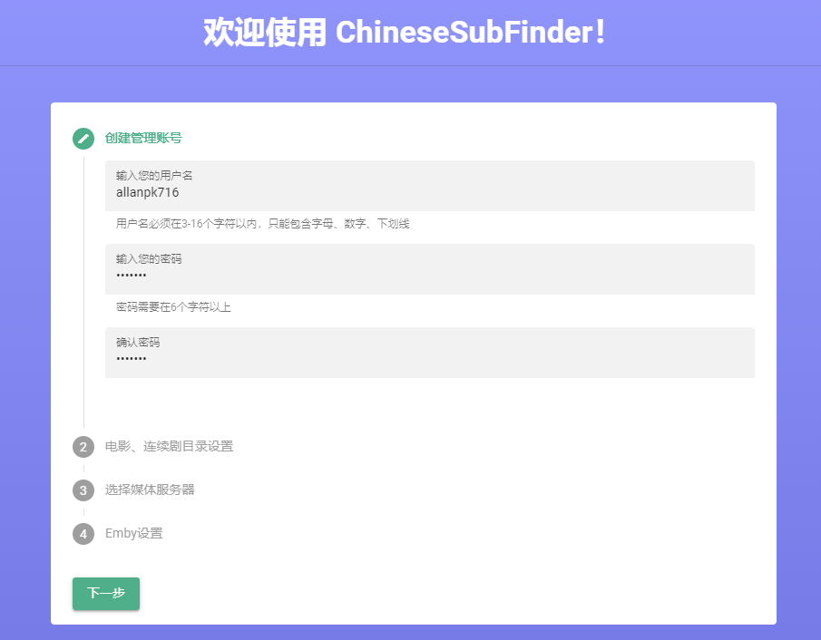
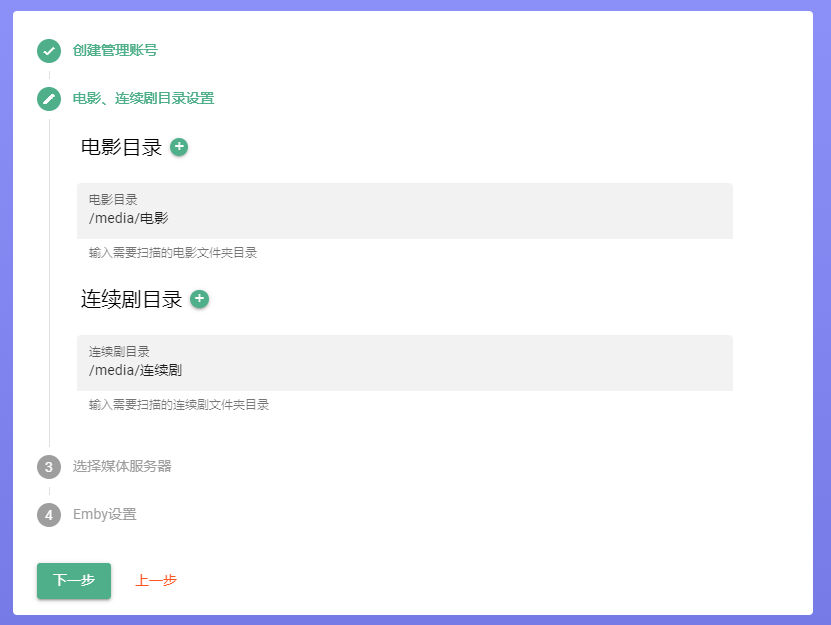
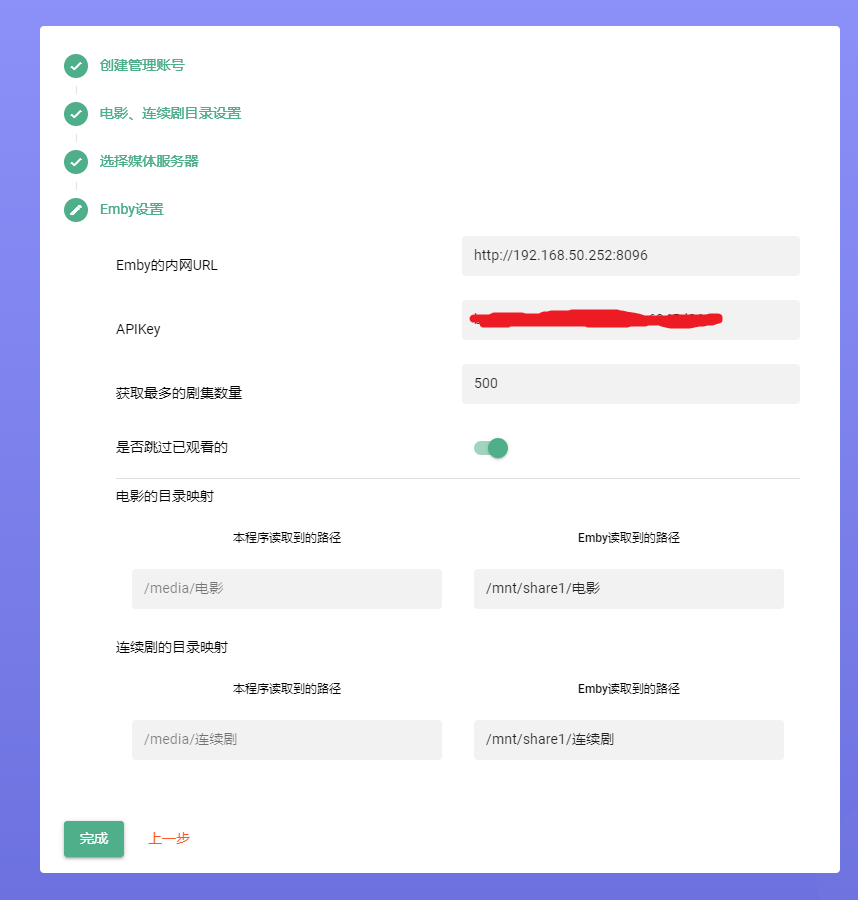
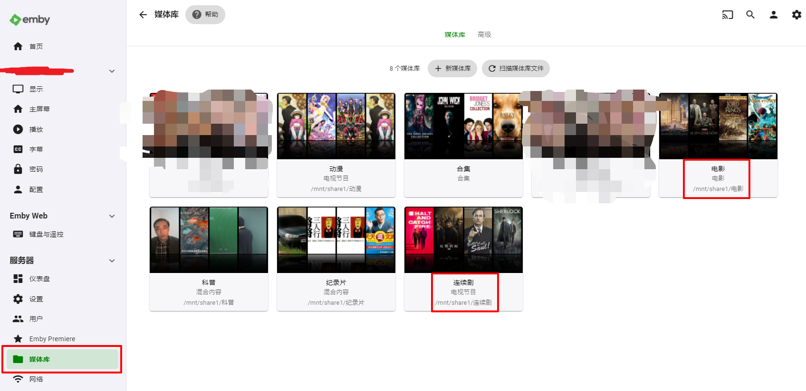
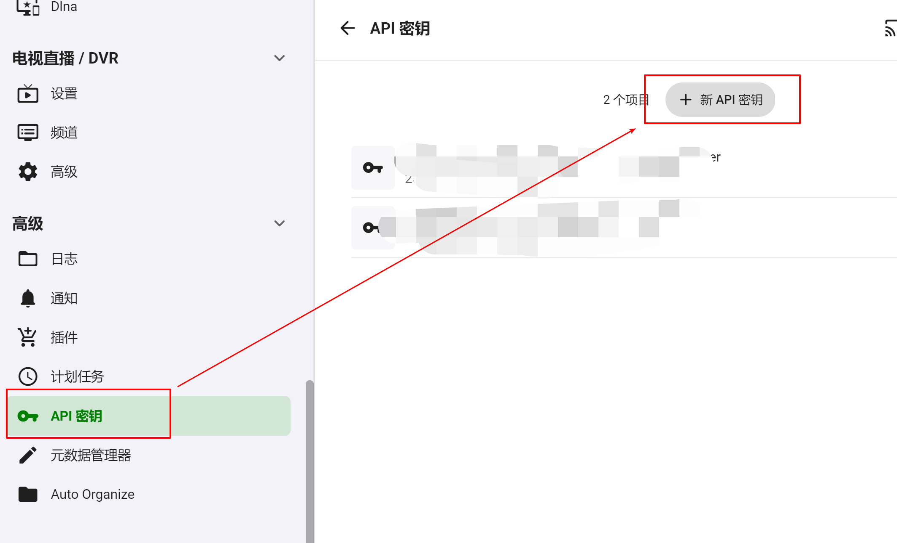

# 02.设置引导界面

> 本教程仅仅适用于 v0.20.x 以及往后的版本，之前的版本不适用本教程。

设置登录的账号、密码，后续登录需要使用。

> 忘记了的话，请去 config（之前配置映射出来的目录） 目录下面，ChineseSubFinderSettings.json 文件中修改对应的字段。

根据之前 docker 配置的信息，以此类推，支持多个路径。

> 每填写完成一个路径后，使当前的输入框丢失焦点即可触发路径是否存在的检测逻辑，如果不对，你需要理一理你在之前配置映射的 Docker 目录是否对。

> 不要配置嵌套的目录，可能会出问题。

> Windows 部署的用户没有那么复杂，直接填写你的物理视频目录即可。

目前支持了 Emby 的 API 功能，其他的暂时都是一样的配置设置。这里以 Emby 来举例。

这里务必把 Emby 中的映射路径填进去，否则无法正确匹配。看下图。

这里填写对应的 Emby API KEY：

然后点击“完成”即可。
