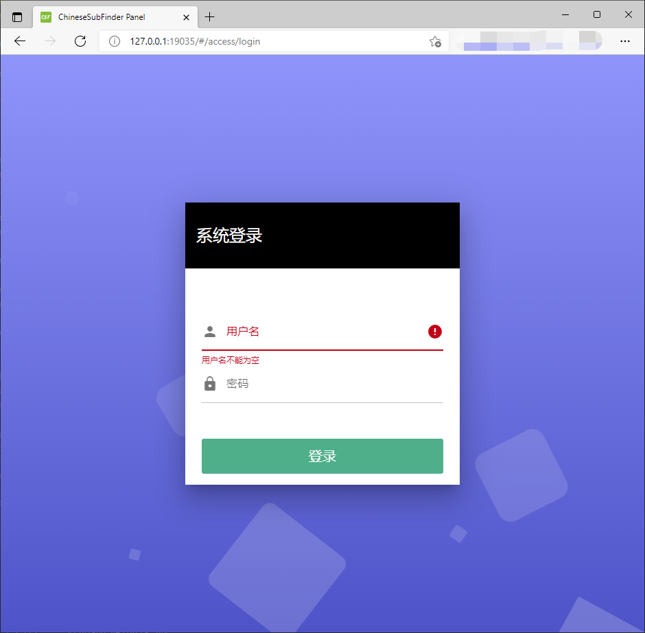
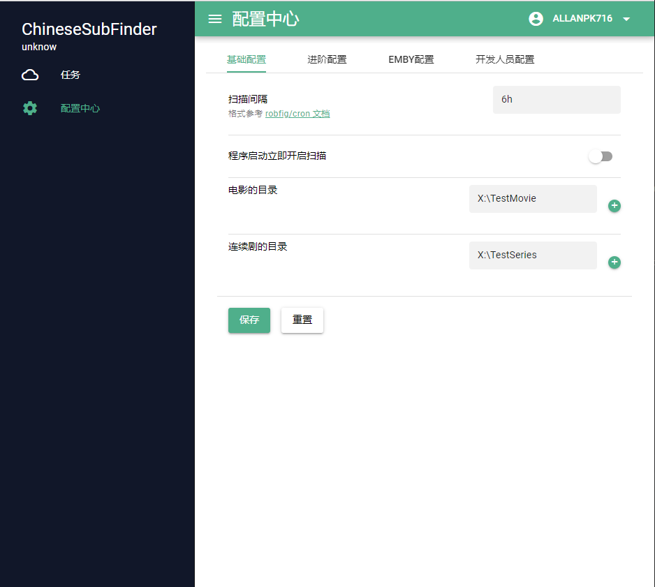
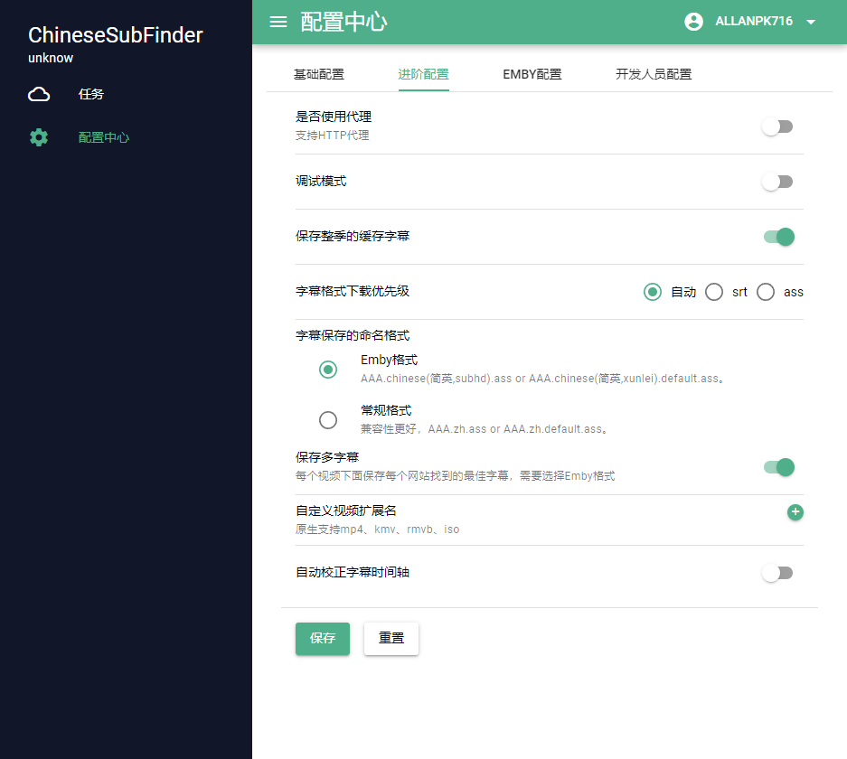
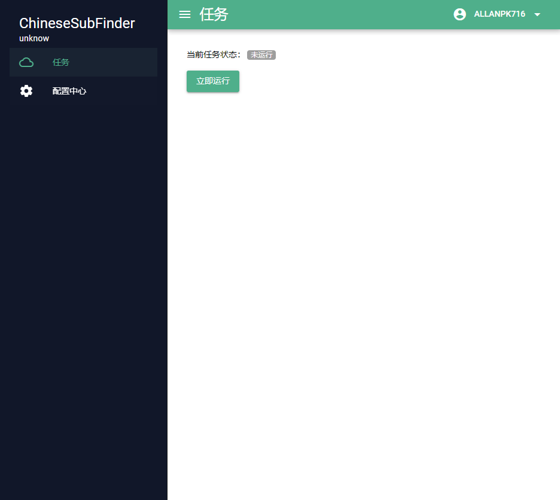
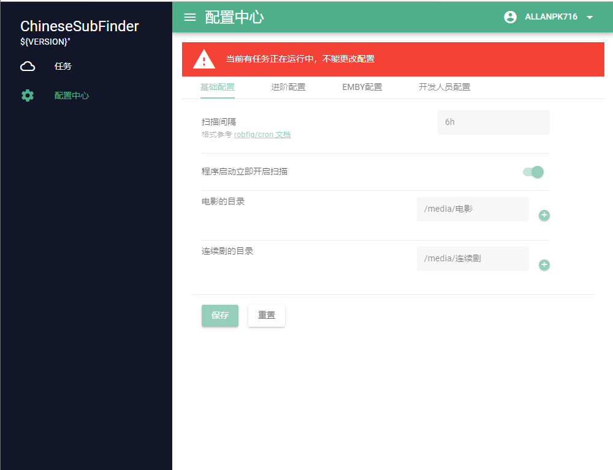

# 03.登录Web设置界面

使用浏览器，输入 http://群晖IP:19035 

输入刚才设置的账号、密码登录。刚才的引导其实就是为了让大家配置起来轻松一点。

> 加入你一开始使用的是 Emby 媒体服务器，后续你修改为了其他的媒体服务器，个人的建议（至少在目前 v0.20.x 版本）是
>
> * 备份 /config/ChineseSubFinderSettings.json
> * 删除  /config/ChineseSubFinderSettings.json
> * 重新用浏览器打开后台的页面地址，会重新走“设置引导”流程
>
> 后续应该会完善这个引导，在设置界面就能够轻松的使用。暂时先用着。

这里需要注意，默认不会在程序启动的时候马上开启“扫描”。如果你需要开启这个功能，你需要在这里手动开启，下一次重启 Docker 或者应用生效。

如果你想使用自动校正字幕时间轴的功能，请打开对应的选项。

详细的介绍和信息见，[字幕时间轴校正 V2](https://github.com/allanpk716/ChineseSubFinder/blob/docs/DesignFile/%E5%AD%97%E5%B9%95%E6%97%B6%E9%97%B4%E8%BD%B4%E6%A0%A1%E6%AD%A3V2.md)，但是文档中使用的文档已经过期，后续会逐步更新调整，看其他是没有问题的，特别是如何反馈问题。

> 这个界面有“字幕保存的命名格式”的设置，注意，如果你是跟着引导进来的，只有引导中选择了 Emby 媒体服务器，这个才会选择是 “Emby 格式”，如果你在引导中选择的非 Emby 的媒体服务器，那么对应的就是 “常规格式”。
>
> 如果后续你修改这个配置，请务必记得，如果你不是 Emby 的媒体服务器，请一定不要选择字幕的命名格式是 Emby格式的，否则你的媒体播放器很可能无法正确加载字幕。当然你也无需担心设置错误，本程序会在启动任务扫描的时候自动帮你修改字幕的格式的。

第一次进入本界面，是不会自动开启扫描任务的，请点击“立即运行”。

如果想要停止扫描字幕的任务，请再次点击“强制停止”，因为作者很懒，只重构了一部分，所以停下来的超时时间很可能最长在 15min 左右，一般会很快停下来。如果你等不急，直接关闭程序或者容器好了。

> 一开始就没有把 context 传递到后续 N 多函数中，所以重构只是大方向能够停下来，一旦到具体的一个任务的执行的时候，就偷懒，不想改了。这里仅仅是提一下。

如果扫描任务在运行的时候，是不允许修改设置的。

请去“任务”界面去强制结束任务后再修改配置。
