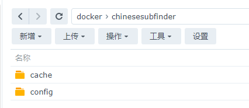
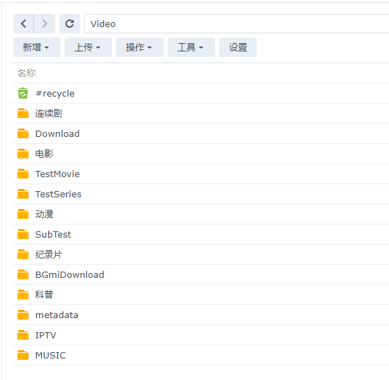
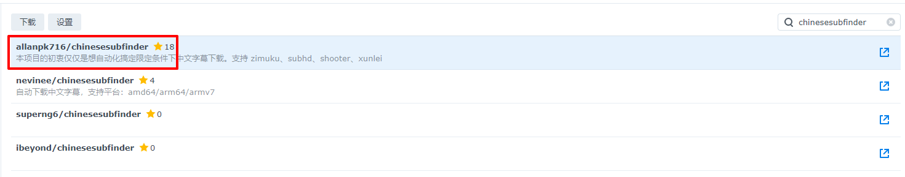
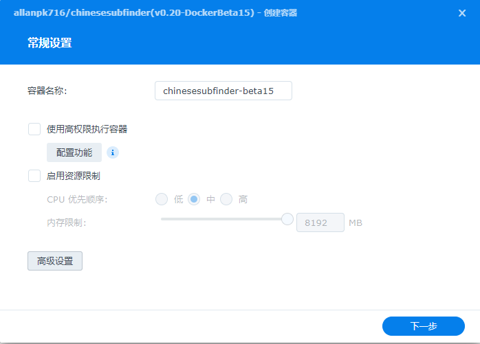
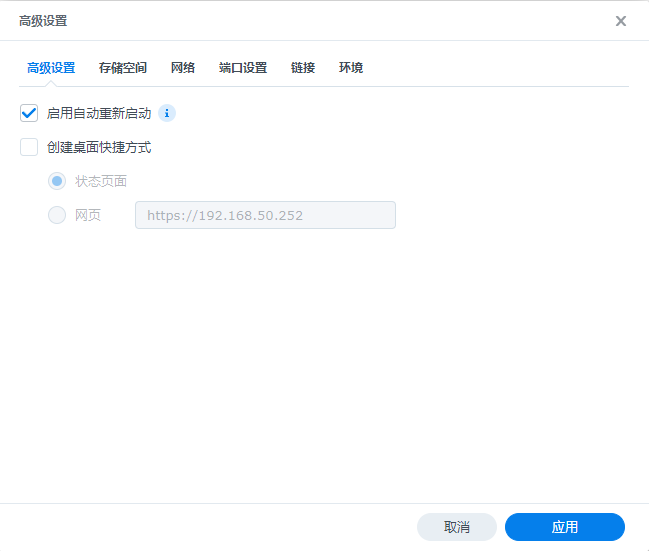
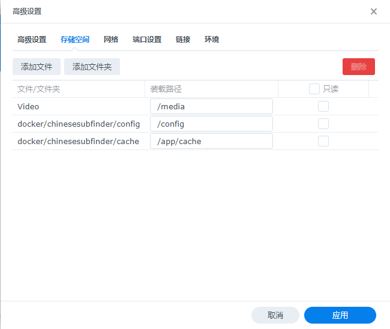
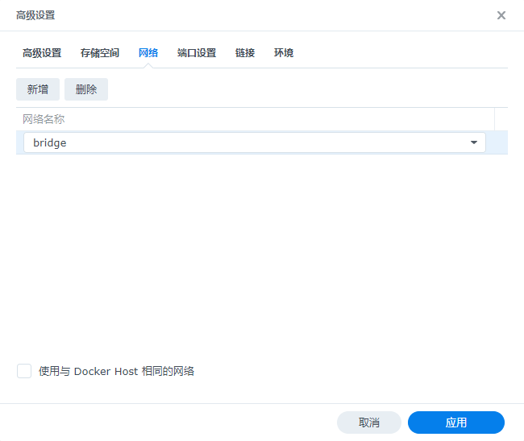
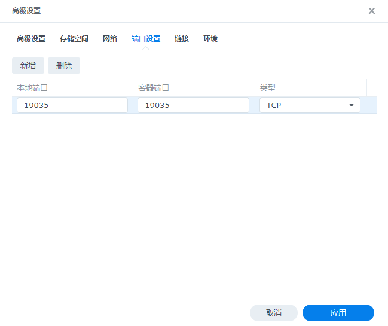

## 00.Docker 部署教程

> 本教程仅仅适用于 v0.20.x 以及往后的版本，之前的版本不适用本教程。

## 前言

使用本程序是有前提的，高度依赖 Emby、Jellyfin、Plex、tinyMediaManager  这类软件对你的视频（电影、连续剧）进行削刮。

### 推荐的电影目录结构

见[文档](https://github.com/allanpk716/ChineseSubFinder/blob/docs/DesignFile/%E7%94%B5%E5%BD%B1%E7%9A%84%E6%8E%A8%E8%8D%90%E7%9B%AE%E5%BD%95%E7%BB%93%E6%9E%84.md)

### 推荐的连续剧目录结构

见[文档](https://github.com/allanpk716/ChineseSubFinder/blob/docs/DesignFile/%E8%BF%9E%E7%BB%AD%E5%89%A7%E7%9B%AE%E5%BD%95%E7%BB%93%E6%9E%84%E8%A6%81%E6%B1%82.md)

## 开始部署

新建一个 chinesesubfinder 文件夹，然后在其中再新建两个文件夹

* config，对应的群晖目录：`/volume1/docker/chinesesubfinder/config`
* cache，对应的群晖目录：`/volume1/docker/chinesesubfinder/cache`

前者，是配置文件的存储目录，Log 文件夹也会出现在其中

后者，是缓存文件夹，特别是使用时间轴自动校正功能必须映射出来

> 对于新手，请务必把这两个都映射出来。



下面会介绍两种使用 Docker 部署的方式，个人是用 [Portainer](https://www.portainer.io/) 去管理 Docker 的，如果你喜欢群晖的管理工具也是可以的。二选一即可。

* Docker-Compose
* 群晖 Docker

下面会以个人的媒体目录结构去介绍配置的方案，请举一反三。有问题请提 [ISSUES](https://github.com/allanpk716/ChineseSubFinder/issues).

首先，本人的媒体目录是在群晖的 `/volume1/Video`，那么需要映射到 Docker 中的 `/media`。



映射的端口号，对内的请不要改，对外的请自行抉择，记住后续的“引导设置”是需要使用 Web 浏览器去配置的。

### Docker-Compose

> 如果使用这个方式部署，就默认你应该知道怎么使用 Docker-Compose or Portainer 了，如果不会，你需要去补这个部分的知识。

```yaml
version: "3"
services:
  chinesesubfinder:
    image: allanpk716/chinesesubfinder:latest
    volumes:
      - /volume1/docker/chinesesubfinder/cache:/app/cache
      - /volume1/docker/chinesesubfinder/config:/config

      - /volume1/Video:/media
    ports:
      - "19035:19035"
      - "19037:19037"   # v0.26 开始用于开启静态文件服务
    environment:
      - PUID=1026
      - PGID=100
      - TZ=Asia/Shanghai
	  - PERMS=true  # 默认是 true，容器启动后会执行media文件夹的提权操作，如果不想执行，则设置为 false
    restart: unless-stopped
```

本人只有一个 /Video 总目录，把所有的电影和连续剧都放在其中，如果你有多个这样的 /Video 文件夹，那么你需要做的是映射多个这种根文件夹到 Docker 中。下面是举例。注意，脚本中指定了映射 docker 中的 media 文件夹的名称，这样才能够有适合的权限去操作这些文件夹。目前内部支持的 media 名称列表有：

* /media

```yaml
# 这个配置是举例，如果你是单个视频目录，就用上面的配置好了。
version: "3"
services:
  chinesesubfinder:
    image: allanpk716/chinesesubfinder:latest
    volumes:
      - /volume1/docker/chinesesubfinder/cache:/app/cache
      - /volume1/docker/chinesesubfinder/config:/config

      - /volume1/Video:/media
      - /volume1/Video1:/media/video1 # 举例
      - /volume1/Video2:/media/video2 # 举例
    ports:
      - "19035:19035"
    environment:
      - PUID=1026
      - PGID=100
      - TZ=Asia/Shanghai
    restart: unless-stopped
```


### 群晖 Docker

> 这里的容器名称和使用的镜像版本仅仅是截图使用，请使用 latest 的 tag 去下载 docker 镜像










> 如果你有多个视频目录（/media）需要映射，见上面的 Docker-Compose 的多目录映射指导，以此类推。




> v0.26 开始用于开启静态文件服务，需要额外把 19037 端口映射出来，也是 19037 即可。图片就懒得更新了，注意哈



### 进入引导设置界面

然后使用浏览器打开，http://群晖IP:19035

> 如果你修改了对外的端口号，请对应的更换即可。
>
> v0.26 开始，容器启动后会有一段时间的初始化，请耐心等待。具体看日志。
>
> 具体见 [v0.26教程](https://github.com/allanpk716/ChineseSubFinder/blob/docs/DesignFile/v0.26教程/v0.26教程.md) 中《运行阶段说明》的描述。

即可进入配置引导界面。
