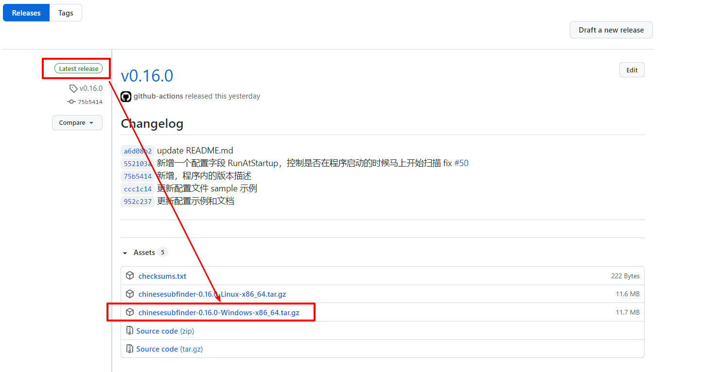
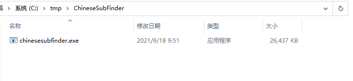

# 01.如何在 Windows 上使用

> 本教程仅仅适用于 v0.20.x 以及往后的版本，之前的版本不适用本教程。

## 前言

使用本程序是有前提的，高度依赖 Emby、Jellyfin、Plex、tinyMediaManager  这类软件对你的视频（电影、连续剧）进行削刮。

### 推荐的电影目录结构

见[文档](https://github.com/allanpk716/ChineseSubFinder/blob/docs/DesignFile/%E7%94%B5%E5%BD%B1%E7%9A%84%E6%8E%A8%E8%8D%90%E7%9B%AE%E5%BD%95%E7%BB%93%E6%9E%84.md)

### 推荐的连续剧目录结构

见[文档](https://github.com/allanpk716/ChineseSubFinder/blob/docs/DesignFile/%E8%BF%9E%E7%BB%AD%E5%89%A7%E7%9B%AE%E5%BD%95%E7%BB%93%E6%9E%84%E8%A6%81%E6%B1%82.md)

## 如何使用

### 找到 Windows 上对应媒体文件夹目录

这里就举例找到两个目录：

* Y:\电影
* Y:\连续剧

> 并且确认你的两个文件夹进过相应的削刮处理，否则识别率很低，或者根本就会跳过识别扫描。

### 下载本程序

到以下的项目路径去下载最新的 exe，[Last Realse](https://github.com/allanpk716/ChineseSubFinder/releases)

然后解压到一个地方，这里是举例，按你自己喜欢的来

### 运行本程序

正常来说就可以直接双击“chinesesubfinder.exe” 就可以启动了。

然后使用浏览器打开，http://127.0.0.1:19035

即可进入配置引导界面。

## 如何设置服务启动

推荐一个 C# 的开源项目，用过很不错，[winsw/winsw: A wrapper executable that can run any executable as a Windows service, in a permissive license. (github.com)](https://github.com/winsw/winsw)

暂时偷个懒，就给网上的教程吧，一般没啥问题的。实在不行，再考虑写一下对应的教程吧。

[开机启动并隐藏 cmd 窗口程序在后台运行 - winsw 使用教程 - P3TERX ZONE](https://p3terx.com/archives/boot-and-hide-the-cmd-window-program-to-run-in-the-background-winsw-tutorial.html)

## 可能遇到的问题

有可能允许的时候崩溃，应该是缺少 GCC 的问题。见 [#101](https://github.com/allanpk716/ChineseSubFinder/issues/101)

