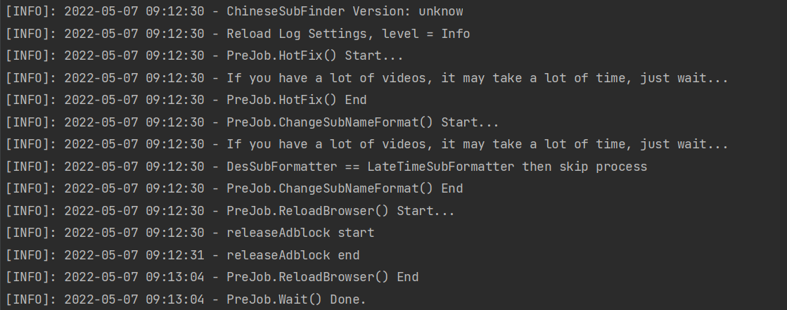
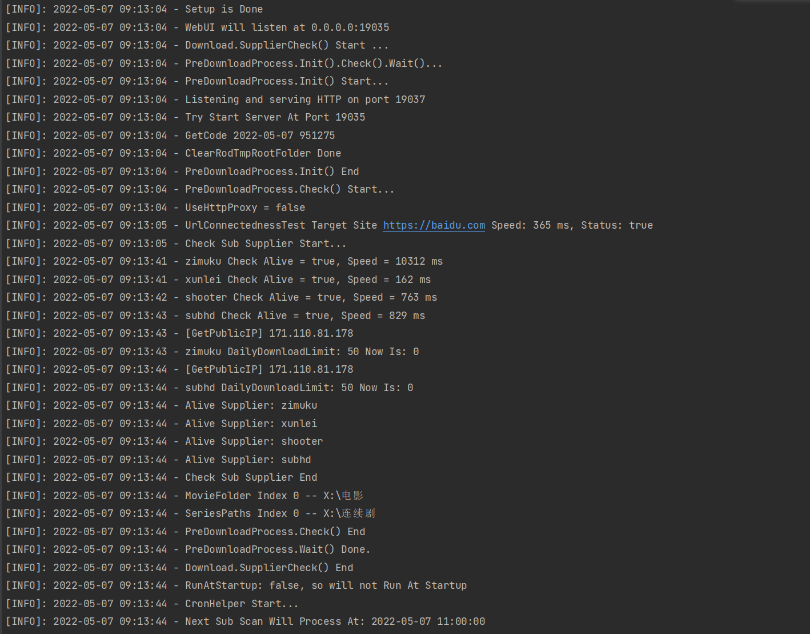

# v0.26教程

## 前言

使用本程序是有前提的，高度依赖 Emby、Jellyfin、Plex、tinyMediaManager  这类软件对你的视频（电影、连续剧）进行削刮。

> 没有削刮的时候，电影可以正常下载字幕，连续剧无法正确下载，如果目录结构不对，也不确定能够下载，也不打算解决类似的问题

### 推荐的电影目录结构

见[文档](https://github.com/allanpk716/ChineseSubFinder/blob/docs/DesignFile/%E7%94%B5%E5%BD%B1%E7%9A%84%E6%8E%A8%E8%8D%90%E7%9B%AE%E5%BD%95%E7%BB%93%E6%9E%84.md)

### 推荐的连续剧目录结构

见[文档](https://github.com/allanpk716/ChineseSubFinder/blob/docs/DesignFile/%E8%BF%9E%E7%BB%AD%E5%89%A7%E7%9B%AE%E5%BD%95%E7%BB%93%E6%9E%84%E8%A6%81%E6%B1%82.md)

## 如何部署

### Docker

[ChineseSubFinder/00.Docker部署教程.md at docs · allanpk716/ChineseSubFinder (github.com)](https://github.com/allanpk716/ChineseSubFinder/blob/docs/DesignFile/v0.20教程/00.Docker部署教程.md)

### Windows

[ChineseSubFinder/01.如何在Windows上使用.md at docs · allanpk716/ChineseSubFinder (github.com)](https://github.com/allanpk716/ChineseSubFinder/blob/docs/DesignFile/v0.20教程/01.如何在Windows上使用.md)

## 设置引导界面

基础的设置跟 [v0.20.x 的教程](https://github.com/allanpk716/ChineseSubFinder/tree/docs/DesignFile/v0.20%E6%95%99%E7%A8%8B) 一样，但是有一点差异。

Emby 与本程序的目录映射是可选的。默认是自动根据 IMDB ID 映射，如果你的削刮程度低，或者根本可能不对，那么建议使用手动目录映射的功能。

## Web 设置界面

因为后续每次更新都会新增或者调整某些功能，界面的功能请根据实际的版本页面的看说明，如果不清楚可以提 issues。

## 运行阶段说明

> 下面描述的启动流程仅适用于本版本，后续可能会调整顺序，但是基本上可以从日志看出来做了什么。
>
> 正常启动程序都会走这个流程，遇到问题请先自行按这个顺去排查和定位问题。

> 再次提一下，很多耗时操作我没有做中途取消的逻辑，你需要的是等，这个跟你的网络和视频资源数量正相关。

程序现在会有两个大的阶段：

* 初始化准备
* 状态检测

对于前者，会做以下几件事：

* Hotfix，修复之前写出来的坑，耗时操作
* 修改字幕的命名格式，这个根据你在引导界面选择的媒体服务器情况来抉择，耗时操作
* 释放 Chrome 、Adblock，耗时操作
* 尝试访问锚点网站（网站联通以及插件测试），耗时操作

对于后者，会做以下几件事：

* 是否进行过引导设置
* 启动 Web 设置界面的服务器（如果没有看到 19035 这个端口号，那么说明服务器没启动，自然是连接不上 Web 界面的）
* 多个字幕源有效性测试，耗时操作
* 代理测试，耗时操作
* 挂载的电影、连续剧目录展示
* 开启第一次扫描（如果你设置了启动立即扫描就会执行，如果没有，则会再定时器设置的时间点启动触发），耗时操作
* 启动定时器

## 如何参与开发

个人的原因（碎片的开发时间、练手 golang），都是断断续续的写，所以从规范性，整体架构设计和代码拆分逻辑都可能存在重复和混乱，基本上会在新功能开发的时候根据实际遇到的坑或者说看之前代码不爽了就重构。

基于上述的梗，我个人建议是比较长的一个阶段来看，最佳的介入时间是在下面几个部分完成插件化或者微服务化后，再系统的看整体的逻辑。

* 字幕源
* 对接的媒体服务器

> 因为想要支持 Windows、Linux、MAC，但是 Windows golang 不支持插件开发，所以，不是我想上微服务这条船···至少也得是 GRPC 吧···

> 分离这两个部分出来的好处是，主程序后续的维护可以更加简明，也可以把分离出来的部分交给社区（虽然现阶段字幕源我觉得也足够可以独立给其他人维护了，但是还有改进的必要性），我也好有精力去做好玩的功能