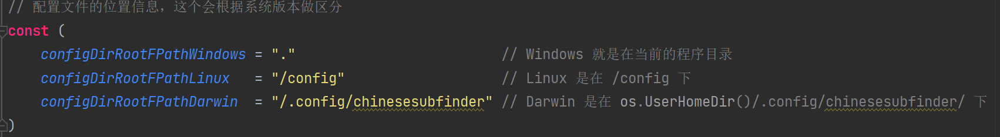

新增两个启动参数：

* `setconfigselfpath`
* `litemode`

前者，仅仅在 Linux 允许环境下，可以设置自定义的 `config` 目录。

后者，可以启用 Lite Mode，不会使用 Chrome ，以及依赖 Chrome 的相关功能。

示例：

```shell
./chinesesubfinder -setconfigselfpath ./config -litemode true
# 启用自定义的 config 路径 ./config
# 开启 LiteMode
```

```shell
./chinesesubfinder
# 全功能启动，根据系统类型，config 目录会有不同的位置
```

