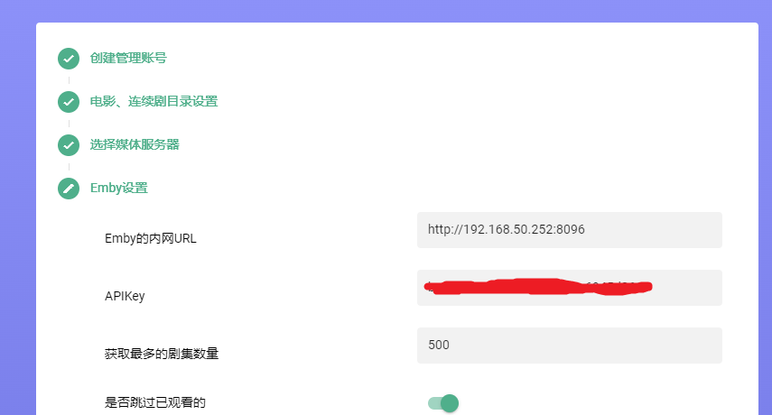
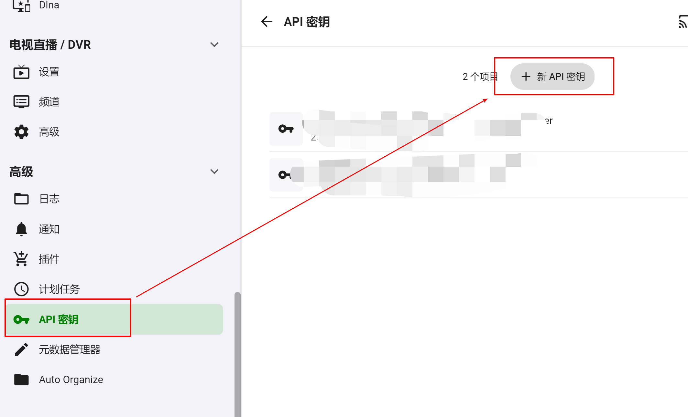

# 第一次使用

> CSF 使用交流目前只有一个 telegram 小组，https://t.me/chinesesubfinder。个人建议是以使用和讨论为主，bug 的反馈最好去 issue 按模板反馈和提出问题，也好有一个地方追溯。

这里假定你已经完成**部署**，根据你的平台请见下面两个教程：

* [Docker 部署教程](https://github.com/allanpk716/ChineseSubFinder/blob/master/docker/readme.md)
* [如何在 Windows 上使用](https://github.com/allanpk716/ChineseSubFinder/blob/docs/DesignFile/v0.20教程/01.如何在Windows上使用.md)

## 引导设置

如果是第一次使用，可以很快就进入 WebUI，因为还没有设置媒体库目录，没有什么额外的检测耗时逻辑。

根据你的网络情况，以`http://ip:19035` 登录 WebUI。如果你使用 Docker 更改了映射的端口，请举一反三。


> 每填写完成一个路径后，使当前的输入框丢失焦点即可触发路径是否存在的检测逻辑，如果不对，你需要理一理你在之前配置映射的 Docker 目录是否对。

> 不要配置嵌套的目录，可能会出问题。

> Windows 部署的用户没有那么复杂，直接填写你的物理视频目录即可。


精力有限，只实现了 emby api 的对接。其他设置选择起始也相当于“无”。




这里填写对应的 Emby API KEY：





然后点击“完成”即可。

## 判断程序是否启动完毕

程序启动的时候，会做一些基础的检查，这个根据你设备的性能以及视频量的多少，启动的耗时每个人的情况是不定的。

但是日志上都会有一下的体现：

> 你可以在 Docker 日志中查看进度。如果是 Windows ，那么要么去看日志文件，要么就看本程序的控制台。

```
[INFO]: 2022-08-25 11:40:20 - Download.SupplierCheck() Start ...
[INFO]: 2022-08-25 11:40:20 - PreDownloadProcess.Init().Check().Wait()...
[INFO]: 2022-08-25 11:40:20 - PreDownloadProcess.Init() Start...
[INFO]: 2022-08-25 11:40:21 - GetCode 2022-08-25 148273
[INFO]: 2022-08-25 11:40:21 - ClearRodTmpRootFolder Done
[INFO]: 2022-08-25 11:40:21 - PreDownloadProcess.Init() End
[INFO]: 2022-08-25 11:40:21 - PreDownloadProcess.Check() Start...
[INFO]: 2022-08-25 11:40:21 - UseHttpProxy = false
[INFO]: 2022-08-25 11:40:21 - UrlConnectednessTest Target Site https://baidu.com Speed: 303 ms, Status: true
[INFO]: 2022-08-25 11:40:21 - Check Sub Supplier Start...
[INFO]: 2022-08-25 11:40:21 - xunlei Check Alive = true, Speed = 153 ms
[INFO]: 2022-08-25 11:40:22 - shooter Check Alive = true, Speed = 736 ms
[INFO]: 2022-08-25 11:40:24 - a4k Check Alive = true, Speed = 1881 ms
[INFO]: 2022-08-25 11:40:25 - csf Check Alive = true, Speed = 728 ms
[INFO]: 2022-08-25 11:40:25 - assrt CheckAlive UserInfo.Status: 0 UserInfo.Quota: 4
[INFO]: 2022-08-25 11:40:25 - assrt Check Alive = true, Speed = 313 ms
[INFO]: 2022-08-25 11:40:25 - Alive Supplier: xunlei
[INFO]: 2022-08-25 11:40:25 - Alive Supplier: shooter
[INFO]: 2022-08-25 11:40:25 - Alive Supplier: a4k
[INFO]: 2022-08-25 11:40:25 - Alive Supplier: csf
[INFO]: 2022-08-25 11:40:25 - Alive Supplier: assrt
[INFO]: 2022-08-25 11:40:25 - Check Sub Supplier End
[INFO]: 2022-08-25 11:40:25 - MovieFolder Index 0 -- /media/电影
[INFO]: 2022-08-25 11:40:25 - SeriesPaths Index 0 -- /media/连续剧
[INFO]: 2022-08-25 11:40:25 - PreDownloadProcess.Check() End
[INFO]: 2022-08-25 11:40:25 - PreDownloadProcess.Wait() Done.
[INFO]: 2022-08-25 11:40:25 - Download.SupplierCheck() End
[INFO]: 2022-08-25 11:40:25 - WebUI will listen at 0.0.0.0:19035
[INFO]: 2022-08-25 11:40:25 - Setup is Done
[INFO]: 2022-08-25 11:40:25 - RunAtStartup: false, so will not Run At Startup
[INFO]: 2022-08-25 11:40:25 - CronHelper Start...
[INFO]: 2022-08-25 11:40:25 - Next Sub Scan Will Process At: 2022-08-25 18:00:00
[INFO]: 2022-08-25 11:40:30 - Try Start Http Server At Port 19035
```

显示 `Try Start Http Server At Port 19035` 那么就说明启动完成了。

> 如果是 Docker 启动，可能会很久，原因是容器启动的时候会对资源文件进行权限的调整，你视频越多，越慢。
>
> 如果第一次启动后，这个权限调整的功能可以跳过，请查阅[Docker 部署教程](https://github.com/allanpk716/ChineseSubFinder/blob/master/docker/readme.md)中的内容

## 使用教程

请查阅额外的使用简介文档。
