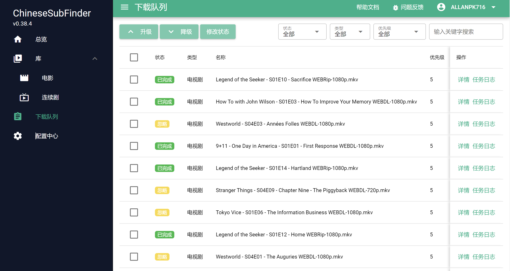

# 软件使用简介

> CSF 使用交流目前只有一个 telegram 小组，https://t.me/chinesesubfinder。个人建议是以使用和讨论为主，bug 的反馈最好去 issue 按模板反馈和提出问题，也好有一个地方追溯。

这里只会介绍最基本的使用，可能看起来会很像流水账，因为确实没有很特别的设置需求，正常用足够满足日常的需求。

> 如果可能都希望大家开启“实验室”--“共享字幕”功能，人人为我，我为人人。

## 判断程序是否启动完毕

程序启动的时候，会做一些基础的检查，这个根据你设备的性能以及视频量的多少，启动的耗时每个人的情况是不定的。

但是日志上都会有一下的体现：

> 你可以在 Docker 日志中查看进度。如果是 Windows ，那么要么去看日志文件，要么就看本程序的控制台。

```
[INFO]: 2022-08-25 11:40:20 - Download.SupplierCheck() Start ...
[INFO]: 2022-08-25 11:40:20 - PreDownloadProcess.Init().Check().Wait()...
[INFO]: 2022-08-25 11:40:20 - PreDownloadProcess.Init() Start...
[INFO]: 2022-08-25 11:40:21 - GetCode 2022-08-25 148273
[INFO]: 2022-08-25 11:40:21 - ClearRodTmpRootFolder Done
[INFO]: 2022-08-25 11:40:21 - PreDownloadProcess.Init() End
[INFO]: 2022-08-25 11:40:21 - PreDownloadProcess.Check() Start...
[INFO]: 2022-08-25 11:40:21 - UseHttpProxy = false
[INFO]: 2022-08-25 11:40:21 - UrlConnectednessTest Target Site https://baidu.com Speed: 303 ms, Status: true
[INFO]: 2022-08-25 11:40:21 - Check Sub Supplier Start...
[INFO]: 2022-08-25 11:40:21 - xunlei Check Alive = true, Speed = 153 ms
[INFO]: 2022-08-25 11:40:22 - shooter Check Alive = true, Speed = 736 ms
[INFO]: 2022-08-25 11:40:24 - a4k Check Alive = true, Speed = 1881 ms
[INFO]: 2022-08-25 11:40:25 - csf Check Alive = true, Speed = 728 ms
[INFO]: 2022-08-25 11:40:25 - assrt CheckAlive UserInfo.Status: 0 UserInfo.Quota: 4
[INFO]: 2022-08-25 11:40:25 - assrt Check Alive = true, Speed = 313 ms
[INFO]: 2022-08-25 11:40:25 - Alive Supplier: xunlei
[INFO]: 2022-08-25 11:40:25 - Alive Supplier: shooter
[INFO]: 2022-08-25 11:40:25 - Alive Supplier: a4k
[INFO]: 2022-08-25 11:40:25 - Alive Supplier: csf
[INFO]: 2022-08-25 11:40:25 - Alive Supplier: assrt
[INFO]: 2022-08-25 11:40:25 - Check Sub Supplier End
[INFO]: 2022-08-25 11:40:25 - MovieFolder Index 0 -- /media/电影
[INFO]: 2022-08-25 11:40:25 - SeriesPaths Index 0 -- /media/连续剧
[INFO]: 2022-08-25 11:40:25 - PreDownloadProcess.Check() End
[INFO]: 2022-08-25 11:40:25 - PreDownloadProcess.Wait() Done.
[INFO]: 2022-08-25 11:40:25 - Download.SupplierCheck() End
[INFO]: 2022-08-25 11:40:25 - WebUI will listen at 0.0.0.0:19035
[INFO]: 2022-08-25 11:40:25 - Setup is Done
[INFO]: 2022-08-25 11:40:25 - RunAtStartup: false, so will not Run At Startup
[INFO]: 2022-08-25 11:40:25 - CronHelper Start...
[INFO]: 2022-08-25 11:40:25 - Next Sub Scan Will Process At: 2022-08-25 18:00:00
[INFO]: 2022-08-25 11:40:30 - Try Start Http Server At Port 19035
```

显示 `Try Start Http Server At Port 19035` 那么就说明启动完成了。

> 如果是 Docker 启动，可能会很久，原因是容器启动的时候会对资源文件进行权限的调整，你视频越多，越慢。
>
> 如果第一次启动后，这个权限调整的功能可以跳过，请查阅[Docker 部署教程](https://github.com/allanpk716/ChineseSubFinder/blob/master/docker/readme.md)中的内容

## 登录

根据你的网络情况，以`http://ip:19035` 登录 WebUI。如果你使用 Docker 更改了映射的端口，请举一反三。

> 在多个文档提到的，本程序目标是挂机，WebUI 是临时一些操作的补充，不要太过于刻意纠结 WebUI 的一些功能。

进入 WebUI 后，会看到如下的界面


“总览”中的守护进程，如果没有在运行，那么就无法开始字幕的下载的。一定守护进程启动，设置就无法更改，要改设置就停止守护进程。

## 库

目前版本的库，仅仅是为了让大家手动能够触发下载字幕的任务。因为正常来说，字幕的扫描是定时的，如果没到那个时间，你下载了视频也不会触发扫描的逻辑。除非你使用外部程序通过 API 去提交任务。

> - [对外的 http api](https://github.com/allanpk716/ChineseSubFinder/tree/docs/DesignFile/ApiKey设计),以及[示例](https://github.com/allanpk716/ChineseSubFinder/issues/336)

第一次使用，需要更新缓存，耗时多久与你设备、网络性能有关，也跟你的视频量有关。耐心等待。并且，这个缓存是当前的，你后续新下载的视频是不会实时更新的。后面有计划重构这个部分，目标是为了另一个重大的功能上线。


## 下载队列

所有的视频的字幕下载任务都会在这里出现。每一个字幕下载就是一个任务，详细的日志请选择具体的一条来看，为什么找不到，出了什么故障，里面写的很清楚。如果发现某一视频下载字幕有问题，请从这里找到对应的日志来反馈。



## 配置中心

这里举例我的配置，请根据你实际的情况来设置

### 基础设置


### 进阶设置

这里没有特殊情况，是不建议修改的。特别是字幕命名格式。


队列设置依然建议不要随意修改，改的太快或者太慢都会影响下载的效果。

默认已经支持电影的蓝光目录，无需额外添加。连续剧的蓝光没有支持。

启用“自动校正字幕时间轴”功能，一定会在某些时刻占用大量 CPU 资源。

### 字幕源设置

目前支持了 assrt 的 api，需要开启，请自行去申请 API KEY。


### Emby 配置

如果你刚从引导设置过来，那么一般来说这里无需调整。但是对于首次扫描，建议调整“最多剧集数量”到 10000，这样才不会漏扫描比较久远放入 emby 的视频。第一次扫描完毕后，或者你几天后再过来改为 300 即可。


### 实验室

#### 共享字幕

这个功能上线有2个月，目前以我个人观察来看，新的剧集，基本可以在3天内拿到比较靠谱的字幕。使用的人越多，这个效果会更好。

#### API KEY

如果你使用 NasTools ，可以联动本程序，在 NasTools 下载完成一个视频后，提交给本程序去下载这个字幕。详细文档和设置可以参考：

[对外的 http api](https://github.com/allanpk716/ChineseSubFinder/tree/docs/DesignFile/ApiKey设计),以及[示例](https://github.com/allanpk716/ChineseSubFinder/issues/336)

与 NasTools 具体联动使用的方法，建议问询 NasTools 相关的群组。
