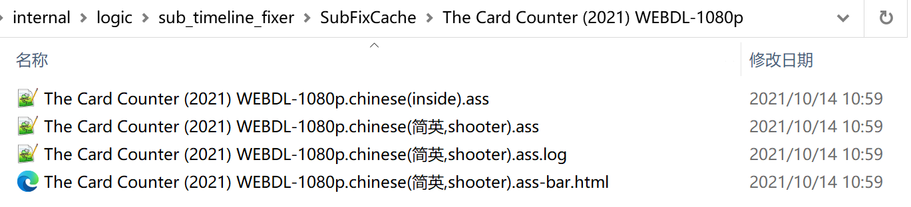
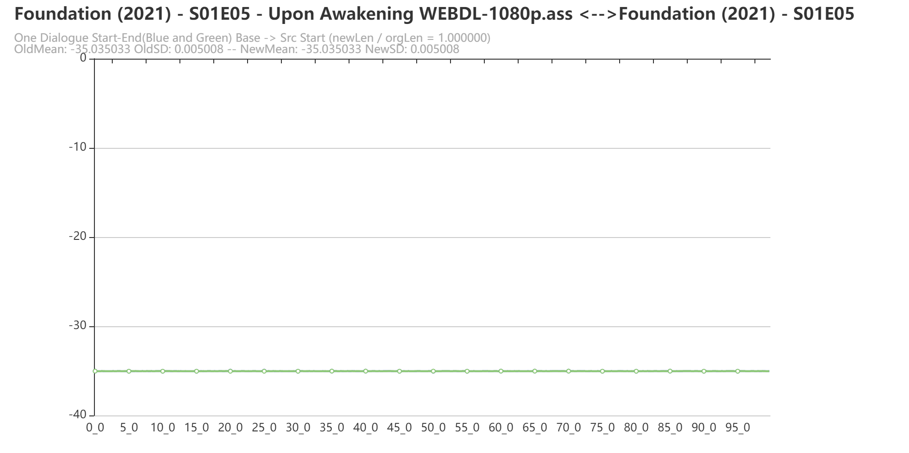
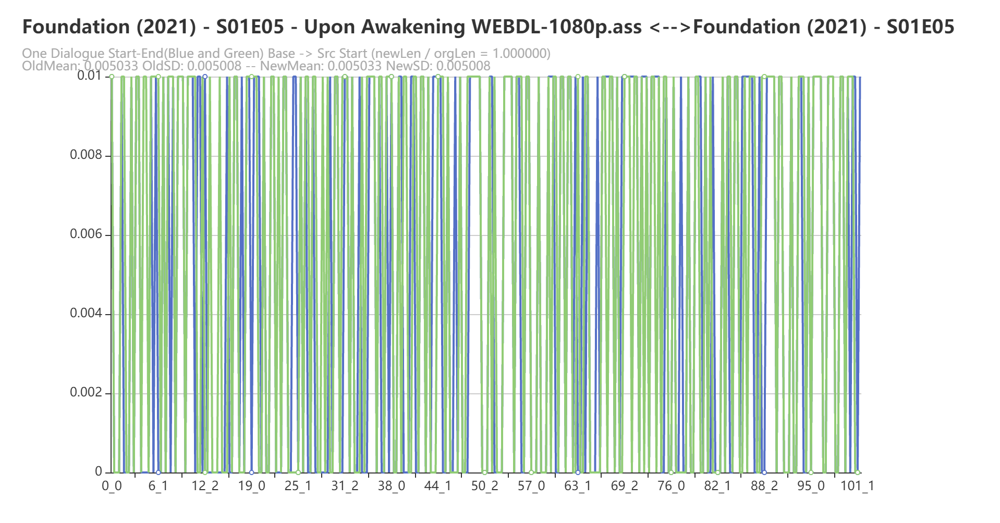

# 字幕时间轴校正

> 本文已经是过时的文档！见参考最新的 《字幕时间轴校正 V2》 文档

> v0.18.x 开始才有此功能
>
> 务必把本文看完，很重要，毕竟新功能，怎么试用，怎么关闭，怎么反馈问题都是必须了解的。谢谢。

## 前言

这个功能在做本软件之初就有想法了，有难度吗？有，可以复杂的做，可以粗暴的做。断断续续实现常规功能的时候，就发现其实有几个点是比较麻烦的。

* 字幕文件的编码解析问题
* 视频内置原生字幕的提取问题（不是后期的硬字幕）
* 基准字幕（正确的时间轴）与源字幕（需要校正时间轴的字幕）如何进行时间轴的对比
* 电影原声的提取
* 语音识别（电影的对白原声转换为对应语言的字幕）
* 多个语言之间的互相翻译转换
* NLP（自然语言处理） 问题

所以目前实现的自动化的字幕时间轴校正是**有限**条件下做到的。

## 功能说明

本功能，将使用 Emby API 去读取视频内部的英文字幕，然后再找到对应外部的双语（简、繁英）字幕，进行校正时间轴。目前版本会在目标目录生成一个类似的文件名（目前是强制的，为了更好的区分是否进行过字幕时间轴的校正）：

> Rick and Morty - S05E10 - Rickmurai Jack WEBRip-1080p.chinese(简英,subhd-fix).ass

然后会在软件的根目录，创建一个文件夹 SubFixCache ，将所有字幕校正相关的中间临时文件都放入这里，以便能够更加容易的反馈遇到的问题（这个功能后续会做开关出来，现在也是强制的，只要开启了这个功能就会出现），类似下图。



### 修复字幕的命名

> 这里很重要，因为某些设置情况下修复字幕会**覆盖**原有的字幕的，需要注意！

这里因为强制需求 Emby API 的支持，那么可以出现两种字幕的命名方式，详细文档见：

* [关于字幕名称命名格式说明](https://github.com/allanpk716/ChineseSubFinder/blob/docs/DesignFile/%E5%85%B3%E4%BA%8E%E5%AD%97%E5%B9%95%E5%90%8D%E7%A7%B0%E5%91%BD%E5%90%8D%E6%A0%BC%E5%BC%8F%E8%AF%B4%E6%98%8E.md)
* [配置建议以及解释](https://github.com/allanpk716/ChineseSubFinder/blob/docs/DesignFile/%E9%85%8D%E7%BD%AE%E5%BB%BA%E8%AE%AE%E4%BB%A5%E5%8F%8A%E8%A7%A3%E9%87%8A.md)

举例：

当选择是 emby 的命名格式的时候，也还有两种可能，前者是开启了，`SaveMultiSub: true`

1. AA.chinese(简英,shooter).ass
2. AA.chinese(简英).ass

那么对应来说，如果进行了字幕时间轴的修复后，会保存对应的 -fix 标记的字幕文件：

1. AA.chinese(简英,shooter-fix).ass
2. AA.chinese(简英).ass

注意，这里第二个就不会变，修复的字幕文件直接覆盖下载的字幕了，因为没有选择保存多个站点的字幕。`SaveMultiSub: false`

> 所以如果是试用本功能，还是建议开启`SaveMultiSub: true`

## 本功能使用的前提条件

使用本功能是有前提条件的，下面任意一条不满足则无法使用。

> 强烈建议，使用 Emby 支持的字幕命名格式，见，[关于字幕名称命名格式说明](https://github.com/allanpk716/ChineseSubFinder/blob/docs/DesignFile/关于字幕名称命名格式说明.md)
>
> 同时建议，设置 `SaveMultiSub: true`，非必须

> 强烈建议，使用 sonarr、radarr 进行电影、连续剧的下载，规范性更好，资源质量也更好。推荐看教程，《[高阶教程-追剧全流程自动化 | sleele的博客](https://sleele.com/tag/高阶教程-追剧全流程自动化/)》

1. 必须，使用 Emby API 功能，见，[**高阶设置 - Emby API 支持**](https://github.com/allanpk716/ChineseSubFinder/blob/docs/DesignFile/%E9%AB%98%E9%98%B6%E8%AE%BE%E7%BD%AE%20-%20Emby%20API%20%E6%94%AF%E6%8C%81.md)
2. 源视频必须有内置的英文字幕（不能是硬字幕，是要能被提取出来的那种内嵌字幕）
3. 待校正的字幕必须是符合本程序的字幕命名要求，见，[关于字幕名称命名格式说明](https://github.com/allanpk716/ChineseSubFinder/blob/docs/DesignFile/关于字幕名称命名格式说明.md)
4. 待校正的字幕必须是中（简、繁）英双语字幕

> 后续会逐步完善自动字幕时间轴校正的功能，现在先试试水，解决一小部分的痛点。

## 本功能如何使用

### 将字幕的缓存文件夹映射出来 docker

这里是举例，至于你的物理路径是啥，需要以你的为准

- /volume1/docker/chinesesubfinder/sub:/app/SubFixCache

如果你是用 docker 部署的，这个很重要，不然看不到。如果是 Windows 下用，那么就是在本程序的路径下生成缓存的文件夹。

### 配置 Config.ymal 文件

首先必须开启 Emby API 的支持，然后设置：

`FixTimeLine: true`

``` yaml
EmbyConfig:
     Url: http://192.168.50.x:8096
     ApiKey: 12345678
     LimitCount: 500
     FixTimeLine: true
```

然后再配置字幕时间轴校正的配置（可选，不写就是默认的配置，见下面的配置解析）

```yaml
SubTimelineFixerConfig:
    MaxCompareDialogue: 3
    StartTimeDiffMaxSD: 0.1
    MinMatchedPercent: 0.1
    MinOffset: 0.3
```

### 配置示例

```yaml
UseProxy: false
HttpProxy: http:/127.0.0.1:10809
EveryTime: 12h
Threads: 4
SaveMultiSub: true
MovieFolder: X:\电影
SeriesFolder: X:\连续剧

EmbyConfig:
    Url: http://192.168.50.x:8096
    ApiKey: 1234567890
    LimitCount: 500
    FixTimeLine: true
# 下面可以不写
SubTimelineFixerConfig:
    MaxCompareDialogue: 3
    StartTimeDiffMaxSD: 0.1
    MinMatchedPercent: 0.1
    MinOffset: 0.3
```

###  使用建议

```yaml
EmbyConfig:
    Url: http://192.168.50.x:8096
    ApiKey: 1234567890
    LimitCount: 50
    FixTimeLine: true
```

* 初次使用这里的 LimitCount 可以设置小一点，这样日志少一点···如果觉得没啥问题可以改到 500 或者你之前的大小。详细见文档，[高阶设置 - Emby API 支持](https://github.com/allanpk716/ChineseSubFinder/blob/docs/DesignFile/%E9%AB%98%E9%98%B6%E8%AE%BE%E7%BD%AE%20-%20Emby%20API%20%E6%94%AF%E6%8C%81.md)
* 强烈建议，使用 Emby 支持的字幕命名格式，见，[关于字幕名称命名格式说明](https://github.com/allanpk716/ChineseSubFinder/blob/docs/DesignFile/关于字幕名称命名格式说明.md)
* 同时建议，设置 `SaveMultiSub: true`，非必须，为何见本文中的，《修复字幕的命名》

## 如何关闭本功能

`FixTimeLine: false` 设置这个为 false ，重新启动本程序。但是，修复保存的字幕暂时不会删除，就是还可能看到 -fix 的字幕。而且缓存修复字幕的文件的文件夹也不会清空。

## 配置字段解析

字幕时间轴配置

```yaml
SubTimelineFixerConfig:
    MaxCompareDialogue: 3
    StartTimeDiffMaxSD: 0.1
    MinMatchedPercent: 0.1
    MinOffset: 0.3
```

* MaxCompareDialogue，默认值 3，最大需要匹配的连续对白
* StartTimeDiffMaxSD，默认值 0.1，对白开始时间的统计 SD 最大误差，超过则不进行修正
* MinMatchedPercent，默认值 0.1，两个文件的匹配百分比（src/base），高于这个才比例进行修正
* MinOffset，默认值 0.3，超过这个(+-)偏移的时间轴才校正，否则跳过，单位秒

## 如何反馈问题

在 issues 界面有对应的反馈收集，可以统一收集问题，也可以单独开 issues ，主要还是要收集足够的数据才好定位问题。

有以下几个信息请务必提供，否则不容易定位问题。

1. 你的 config.yaml 配置文件信息
2. 日志的相关信息截图或者复制文字
3. 本程序根目录下 SubFixCache 文件夹中对应需要反馈字幕时间轴校正问题的视频的缓存文件

这里是举例，请举一反三：


## 后续可能会支持的字幕自动校正的功能

下面会继续开发的功能应该是以下的顺序，非常有可能踩到坑出不来了，也就鸽了:sweat_smile:

1. 根据内置的英文字幕，去校正外置的中文字幕
2. 根据内置的韩、日字幕，去校正外置的中文字幕
3. 根据视频的英文音轨，去校正外置的双语中（简、繁）英字幕
4. 根据视频的英文音轨，去校正外置的中文字幕
5. 在不使用 Emby 的前提下，提取内置字幕、内置音轨（这样不使用 Emby 的人群也能够用本功能）

## 修复截图效果





