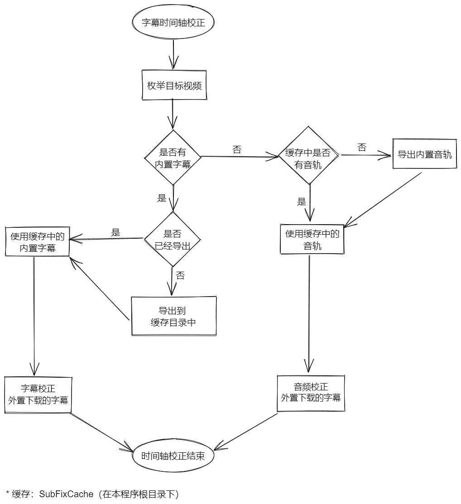
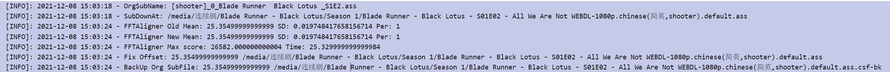
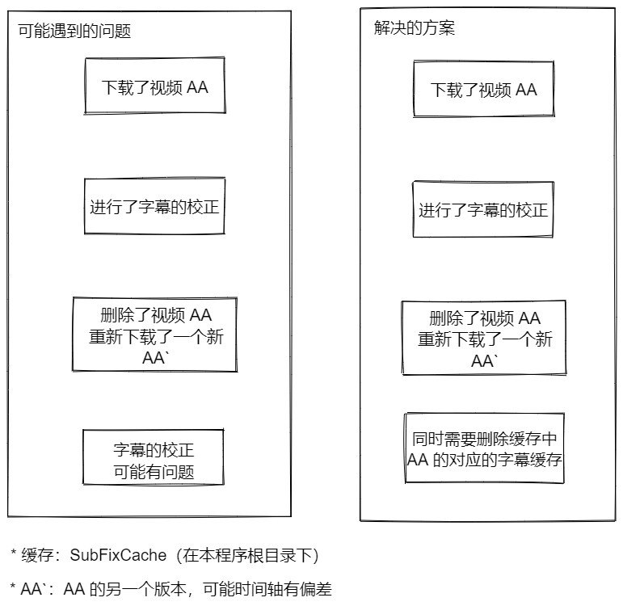

# 字幕时间轴校正 V2

> v0.19.x 开始启用

## 前言

V1 版本（v0.18.x）实现的方向是使用 NLP（自然语言处理）去对比两个字幕，进行时间轴的校正，这里就会存在一个限制，基准字幕必须是英文，待校正字幕必须是中英（因为使用英文作为对比的参考标准）。

有收到网友邮件的提醒，有个 python 项目做时间轴校正很棒，[ffsubsync](https://github.com/smacke/ffsubsync)。**特别感谢**这个项目的开源，经过断断续续 2 个月的折腾，最终还是选择使用 golang 重写（抄）这个项目的核心匹配算法（自己找的匹配算法，效率极低，在 ffsubsync 的介绍中作者有提及相关的细节，大家可以过去看看）。核心算法之外，外围的调用逻辑因为个人能力有限，看 python 代码头疼就自己做了，所以还原度很接近 ffsubsync，但是有一些细节会比它做的差。如果各位发现了，请提交 issues。

之所以不想直接调用上述项目，还是考虑到尽可能能够“独立”单文件运行（不排除后续会把 FFMPEG  打包到项目内，作为静态资源提供）。

## 功能说明

目的是根据视频文件的**内置字幕**或者是**音频**，对外置字幕的时间轴校正。基本的校正流程图如下：

> 只有本轮扫描，**新**下载的字幕才会触发，旧字幕不会触发本逻辑。



时间轴的校正需要内置字幕或者视频的音频作为基准，那么这两个都需要从原有的视频中导出。这个导出的过程是需要 ffmpeg 读取完整的视频内容才能都导出的，因此，第一次使用本功能，一定会花比较多的时间和资源去完成上述基准数据的导出。且导出的音频大小一般不低（可能有 5 - 100 mb），当然本程序有做缓存，所以仅仅是第一次花时间，不会重复导出。

> 不会全盘导出，而是进入本轮下载的视频才会走这个导出的判断流程。

缓存目录在本程序的根目录下的：CSF-SubFixCache 文件夹中

> 除非你不打算使用本功能了，否则不建议清理。因为一般来说，新的视频都是有内置字幕的，就不会导出音频，所以占用的空间不会多。

### 项目依赖

> 相对于 V1 版本，现在不依赖 Emby

本功能**强**依赖 FFMPEG 和其子模块 ffprobe，如果你使用的是本项目制作的 docker 那么无需关心依赖问题，会在镜像中集成。

> 如果你是 Windows 上使用，请务必自行下载安装 FFMPEG ，理论上会把 ffprobe 也安装上。且保证能够在 cmd 中直接使用 FFMPEG  和 ffprobe 去使用该可执行程序。否则无法正常使用该功能。

### 如何使用

在 config.yaml 中，加入一个设置项即可。

```yaml
UseProxy: false
HttpProxy: http://192.168.50.252:20172
EveryTime: 12h
Threads: 1
SaveMultiSub: true
SubNameFormatter: 0
MovieFolder: X:\TestMovie
SeriesFolder: X:\TestSeries
RunAtStartup: true
DebugMode: false

FixTimeLine: true # 开启时间轴的自动校正功能，默认不写则不开启
```

> 不同于 V1 版本的功能，之前是强依赖 Emby 的字幕导出功能（其实也是 FFMPEG 实现的）。现在为了能让一般用户也用上，所以就在项目中自行实现了 FFMPEG 的调用。所以设置的 FixTimeLine 字段也提升到一级设置中。

### 如何关闭本功能

1. 关闭本程序
2. 设置 config.yaml 的 FixTimeLine: false，或者删除这个字段
3. 在本程序的根目录下，新建一个空白的文件：RestoreFixTimelineBK
4. 重新允许本程序

> 第 3 步是非必须执行的，如果你发现自动校正的文件普遍有问题，那么就执行第 3 步
>
> Docker，则是对应在类似的映射目录中：/docker/chinesesubfinder:/config  新建 RestoreFixTimelineBK
>
> Windows，则是在本程序 Exe 根目录下新建 RestoreFixTimelineBK

步骤 3，会执行从备份的字幕文件还原的操作。新建的文件是一次性的，用一次就会删除。

### 字幕时间轴校正的效果

日志的效果见下图：



现在修正的字幕会替换原有的字幕，原有的字幕会加一个后缀名（.csf-bk)进行备份存储。如果你发现自动校正的有问题，可以还原回去）

## 已知的问题

### 1 

由于本程序还没有实现完善的缓存机制，所以以下举例一种特殊情况，会导致字幕校正可能出错。




简单说就是，如果你最开始下载的视频 AA ，并且使用本程序下载了对应的字幕且进行了校正。那么如果你删除了 AA 去下载了 AA` 视频，那么就会导致缓存中的内置字幕或者音频是对应错误的，从而导致字幕的校正功能错误。应对的方案就是删除对应的缓存。

> AA 可能是 Web 版本，然后又删除了，下载了 AA` 是 DVD 版本，这两个一般来说很可能时间轴就是不一样的。

### 2

目前程序默认的最大时间轴校正范围是 120s（一般来说是因为有剧情前要这个部分的出现导致的，120s 很长了，ffsubsync 默认是 60s。如果遇到问题就改回默认的 60s），如果视频的字幕偏移超过这个数值了，需要额外的设置全局的配置。

```
SubTimelineFixerConfig:
	V2_MaxOffsetTime: 120 // 默认是 120s，如果遇到特殊的可以调整这个值
```

当然目前这个方案是不推荐的，后续会引入 Web 设置界面，**应该会**允许选中某个视频进行单独的时间轴校正操作。这个有待堆代码。

### 3

有一种情况，现在有一个视频是有“前情回顾”的视频 AA，但是下载了没有“前情回顾”的字幕 AA.srt，那么进行时间轴校正的时候，你会发现“前情回顾”这部分是没有字幕的，原因你应该懂吧。但是到正常的剧情部分字幕就有了。

### 4

目前发现下载的有些 ass 字幕，使用 Emby 加载是无法显示字幕的，这个并不是跟本程序的校正有关系，如果有一份你可以使用备份的字幕去加载读取试试，如果确实是本程序引起的，务必上传对应的字幕文件上来。

## 如何反馈问题

假如你觉得视频 AA.mp4 的下载字幕 AA.srt 校正后的效果有问题，那么请按照一下流程收集相应的信息一并打包发送反馈。

1. 需要找到本程序根目录下的 CSF-SubFixCache 文件夹，然后从找到对应需要反馈的视频 AA 文件夹，把整个文件夹 AA ，复制下来（里面都是内置的导出字幕和音频）；
2. 找到 AA.mp4 同级目录下的  AA.srt  和  AA.srt.csf-bk ，复制下来；
3. 将上述两个步骤收集到的文件打包反馈；