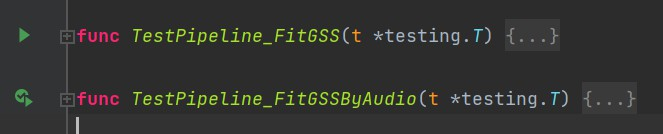
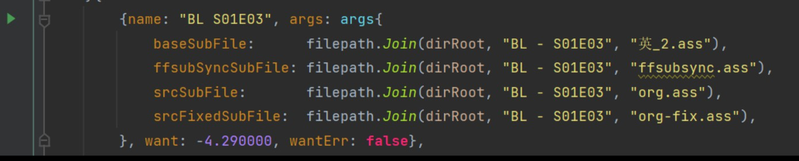
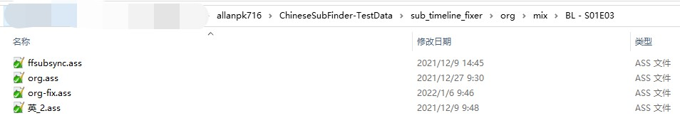
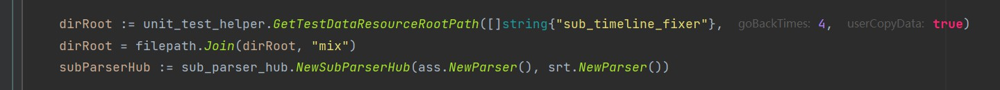

# 时间轴校正单元测试使用说明

首先下载两个源码：

* [ChineseSubFinder](https://github.com/allanpk716/ChineseSubFinder)
* [ChineseSubFinder-TestData](https://github.com/allanpk716/ChineseSubFinder-TestData)

前者是本项目的源码，后者是单元测试用到的外部数据，务必放置在相同一级的目录中

```
AA:
-- ChineseSubFinder
-- ChineseSubFinder-TestData
```

找到`internal/pkg/sub_timeline_fixer/pipeline_test.go`这个单元测试文件：



这里列出来的两个函数：

* 前者是使用字幕校正字幕
* 后者是使用音频校正字幕

一下会举例一个外部测试文件的使用方式，请举一反三：



这里有一个使用字幕校正字幕的测试用例。

* 英_2.ass，基准字幕，一般是内置字幕

* ffsubsync.ass，这个是使用 ffsubsync 校正出来的字幕（非必须）

* org.ass，这个是你想要校正的外部字幕

* org-fix.ass，校正后的字幕保存名字

* want，你期望的时间偏移秒

  > 这里偷懒，其实应该有一定的校正误差偏移，比如 +- 0.1s ，如果你期望是 0s，但是校正结果是 0.01 s 那么这不是问题，你应该懂我意思吧。

那么再让我们看看具体这些数据存放再哪里



为什么要这么存放，原因比较复杂，核心就是不想再使用过数据后人为去还原清理，不然 git 需要反复的更新。具体实现的细节，看单元测试中开始时的数据和路径准备。

