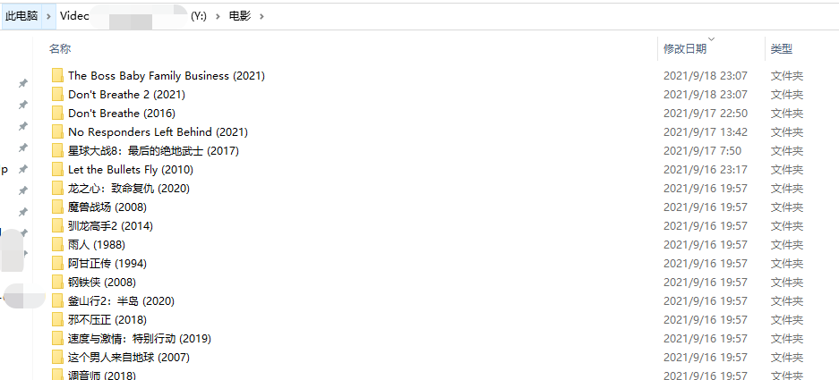
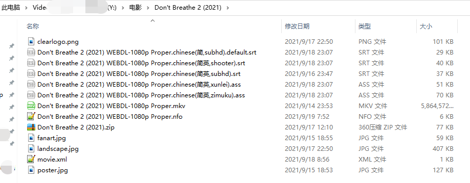
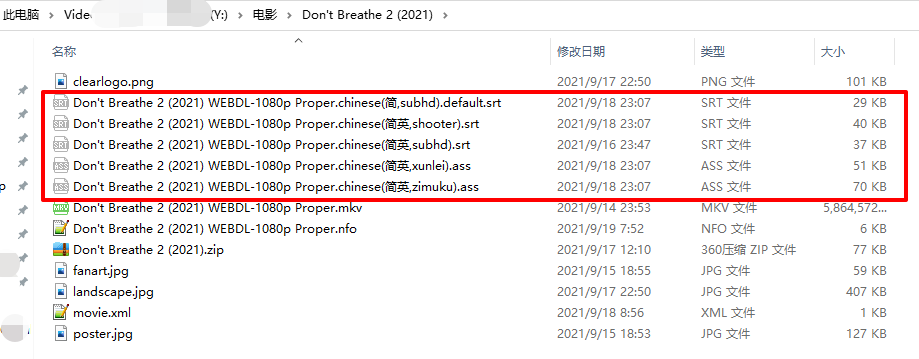

# 电影的推荐目录结构

> 使用本程序是有前提的，高度依赖 Emby、Jellyfin、Plex、tinyMediaManager  这类软件对你的视频（电影、连续剧）进行削刮。

一般来说，默认你的电影目录进过上述软件（**上述的软件记得设置，存储媒体信息（元数据）到对应的视频目录下**）处理后是这样的：

然后每一部电影内的结构例如（这个是自动化完成的）

下面红框中的字幕就是本程序下载的

