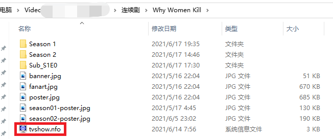

# 连续剧目录结构要求

连续剧字幕自动下载的功能**严重**依赖于 IMDB ID，所以会自动去每个剧集的目录中找 **tvshow.nfo** 这个文件，这个文件是 emby 或者 sonarr 自动生成的。

> **如果你的剧集没有经过 emby 或者 TMM 的整理，那么抱歉，本功能将无法正常使用！**

## 目录结构的限制

这里强制要求了连续剧目录的存放结构，**务必一致**。连续剧仅仅支持搜索**一级**目录。假如你是使用 docker 来挂载的（以此类推其他系统下的配置）：

* SeriesFolder: /media/连续剧

那么支持搜索

- /media/连续剧/连续剧1
- /media/连续剧/连续剧2

不支持搜索

- /media/连续剧/连续剧3/连续剧3-1

## 目录结构

目录结构如下图：

> 可以看出，下面的目录名称是两个程序混合削刮的。后面带有 （年份）是之前手动下载的连续剧然后经过 TMM 削刮的，纯英文文件夹名称的是 sonarr 自动下载的连续剧

## 每一集的命名样式

如下图，如果你的连续剧被 emby 或者 TMM 整理过，那么就有类似的命名样子。那么连续剧的自动搜索功能才能正确生效，否则无法正常使用。

