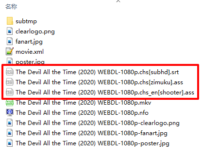
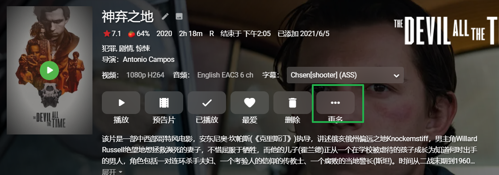
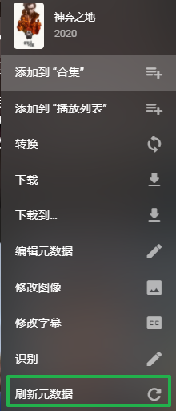
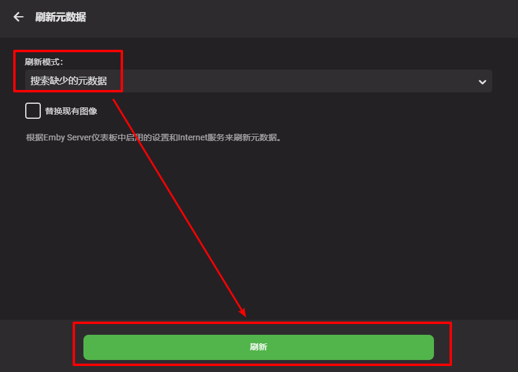
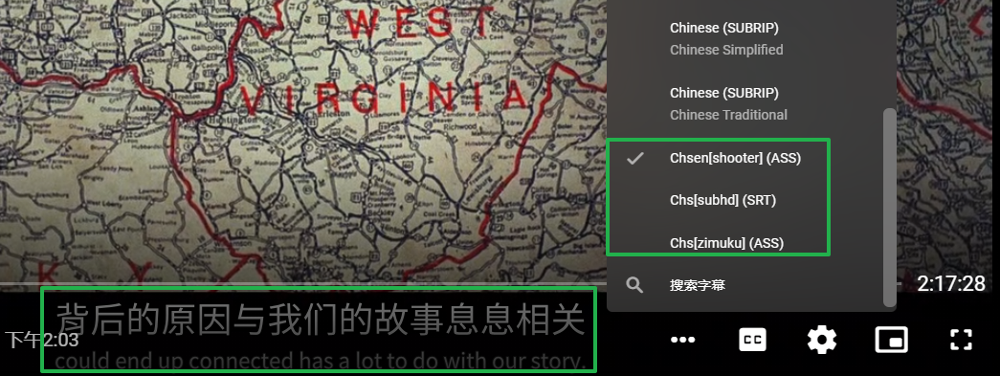
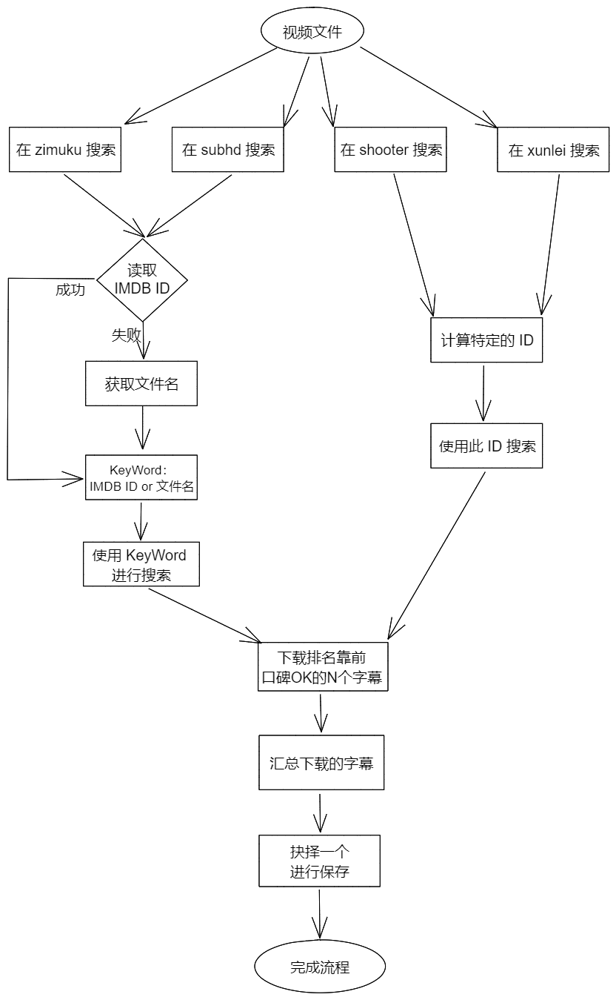

# ChineseSubFinder

本项目的初衷仅仅是想自动化搞定**限定条件**下 **中文** 字幕下载。

## Why？

注意，因为近期参考《[高阶教程-追剧全流程自动化 | sleele的博客](https://sleele.com/tag/高阶教程-追剧全流程自动化/)》搞定了自动下载，美剧、电影没啥问题。但是遇到字幕下载的困难，里面推荐的都不好用，能下载一部分，大部分都不行。当然有可能是个人的问题。为此就打算自己整一个专用的下载器。

手动去下载再丢过去改名也不是不行，这不是懒嘛...

首先，明确一点，因为搞定了 sonarr 和 raddarr 以及 Emby，同时部分手动下载的视频也会使用 tinyMediaManager 去处理，所以可以认为所有的视频是都有 IMDB ID 的。那么就可以取巧，用 IMDB ID 去搜索（最差也能用标准的视频文件名称去搜索嘛）。

## 功能

### 支持的视频分类

|  类型  | 是否支持 |                  备注                   |
| :----: | :------: | :-------------------------------------: |
|  电影  |    ✔     | 已经支持，通过 IMDB、或者文件名进行搜索 |
| 连续剧 |    -     |                正在考虑                 |
|  动画  |    -     |                正在考虑                 |


### 支持的字幕下载站点

* zimuku
* subhd （注意，docker 下无法下载，原因看下面）
* shooter
* xunlei

### 优先级

网站字幕优先级别暂定 ：zimuku -> subhd -> xunlei -> shooter

### 支持的视频格式

* mp4
* mkv
* rmvb
* iso

### 字幕格式优先级

暂时没打算实现

### 字幕语言类型优先级

* 双语 -> 单语种
* 简体 -> 繁体


## How to use

注意，使用本程序前，**强烈推荐**使用 emby 或者 tinyMediaManager 对你的视频进行基础的削刮，整理好视频的命名。

### 使用 docker-compose 部署

> 尝试后发现，目前无法用 docker 中的 browser 去模拟点击操作，所以，docker 部署，无法支持 subhd 的字幕下载

编写以下的配置文件，注意 docker-compose 文件需要与本程序的 config.yaml 配套，特别是 MovieFolder 这个。

```yaml
version: "3"
services:
  chinesesubfinder:
    image: allanpk716/chinesesubfinder:latest
    volumes:
      - /volume1/docker/chinesesubfinder/config.yaml:/app/config.yaml
      - /volume1/Video/电影:/app/videofolder
    environment:
      TZ: Asia/Shanghai
    restart: unless-stopped
```

然后把 config.yaml.sample 复制一份，重命名为 config.yaml，内容如下（每个配置啥意思见《配置文件解析》）

```yaml
UseProxy: false
HttpProxy: http://127.0.0.1:10809
EveryTime: 6h
DebugMode: false
SaveMultiSub: false
FoundExistSubFileThanSkip: true
UseUnderDocker: true
MovieFolder: /app/videofolder
```

### 有图形界面的操作系统下直接运行

> 注意，如果你是在 Windows（类似 Llinux MAC OS 有图形化界面的系统）上使用
>
> 那么是可以支持在 subhd 的字幕下载的
>
> 那么 config.yaml 中的 UseUnderDocker可以设置为 fasle

举例，在 Windows 下运行。

```yaml
UseProxy: false
HttpProxy: http://127.0.0.1:10809
EveryTime: 6h
DebugMode: false
SaveMultiSub: false
FoundExistSubFileThanSkip: true
UseUnderDocker: false
MovieFolder: X:\电影
```

### 配置文件解析

把 config.yaml.sample 复制一份，重命名为 config.yaml，内容如下：

```yaml
UseProxy: false
HttpProxy: http://127.0.0.1:10809
EveryTime: 6h
DebugMode: false
SaveMultiSub: false
FoundExistSubFileThanSkip: true
UseUnderDocker: true
MovieFolder: X:\电影
```

* UseProxy，默认false。是否使用代理，需要配合 HttpProxy 设置
* HttpProxy，默认 http://127.0.0.1:10809。http 代理这里不要留空，不适应就设置 UseProxy 为 false
* EveryTime，，默认 6h。每隔多久触发一次下载逻辑。怎么用参考，[robfig/cron: a cron library for go (github.com)](https://github.com/robfig/cron)
* DebugMode，默认 false。调试模式，会在每个视频的文件夹下，新建一个  subtmp 文件夹，把所有匹配到的字幕都缓存到这个目录，没啥事可以不开。开的话就可以让你手动选择一堆的字幕啦。
* SaveMultiSub，默认值 false。true 会在每个视频下面保存每个网站找到的最佳字幕（见下面《如何手动刷新 emby 加载字幕》，会举例）。false ，那么每个视频下面就一个最优字幕。
* FoundExistSubFileThanSkip，默认 true。是否跳过已经下载过 sub 的视频。
* UseUnderDocker，默认值 true。如果是 ture，那么就不行启用 subhd 的下载（原因见《使用 docker-compose 部署》）
* MovieFolder，填写你的电影的目录（暂时只支持电影，后续会支持其他的类型）

### 如何手动刷新 emby 加载字幕

首先，本程序会自动下载字幕文件，如下图:

> 这里演示开启了 SaveMultiSub: true ，也就是把每个网站最优的字幕都存下来
>
> 如果没有开启 SaveMultiSub: false,.那么就是下载一个。后续的刷新操作一样



然后，去 emby 对应影片的详情页面，点击“更多”。如下图



然后点击“刷新元数据”



注意，这里“搜索缺少的元数据”，没必要全刷新



直接播放影片，点击 “CC” 这个按钮是不是看到对应的字幕列表了。



## 版本

* 完成初版，仅仅支持电影的字幕下载 -- 2021年6月13日

## TODO

* 字幕的风评（有些字幕太差了，需要进行过滤，考虑排除，字幕组，关键词，机翻，以及评分等条件
* 加入 Web 设置界面（也许没得很大的必要···）

## 设计



## 限定条件

* 电影（暂时做这个类型，后续会考虑：连续剧、动画）

* 只搜索中文字幕

* 必要条件，视频文件经过削刮器处理

* 搜索优先级

  * 经过削刮器处理
    1. 视频经过削刮器（tinyMediaManager、Emby）处理，视频同级目录有 *.nfo 文件（Kodi 格式的）
    2. 使用 Raddarr 下载的电影， Metadata 设置 Emby，存在一个 movie.xml 文件
    3. 以上两个文件任意一个能读取到 IMDB ID
  * 通过视频文件的唯一ID（针对不同搜索方式不同）进行搜索
  * 视频文件名
  
* 支持的网站

  * subhd（根据优先级）

  * zimuku（根据优先级）

  * shooter（通过视频文件的唯一ID）

  * 迅雷（通过视频文件的唯一ID）

## 感谢

感谢下面项目的帮助

* [Andyfoo/GoSubTitleSearcher: 字幕搜索查询(go语言版)，支持4k 2160p,1080p,720p视频字幕搜索，集合了字幕库、迅雷、射手、SubHD查询接口。 (github.com)](https://github.com/Andyfoo/GoSubTitleSearcher)
* [go-rod/rod: A Devtools driver for web automation and scraping (github.com)](https://github.com/go-rod/rod)
* [ausaki/subfinder: 字幕查找器 (github.com)](https://github.com/ausaki/subfinder)
