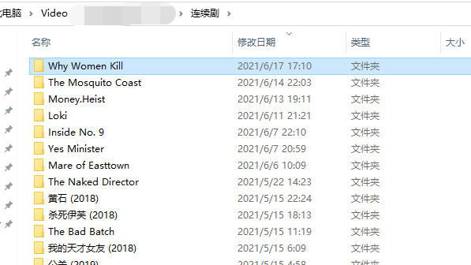
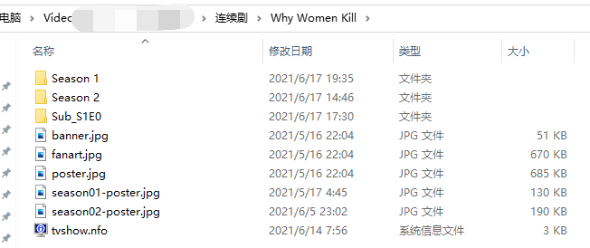
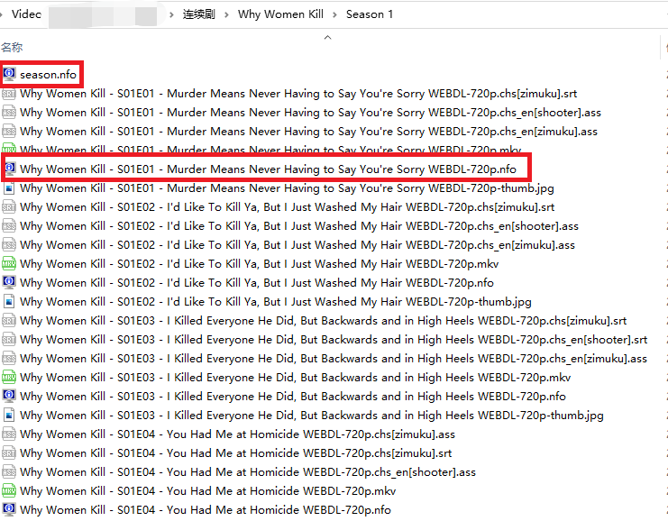

# ChineseSubFinder

本项目的初衷仅仅是想自动化搞定**限定条件**下 **中文** 字幕下载。

> 开发中，可能有不兼容性的调整（配置文件字段变更）
>
> 最新版本 v0.6.x 支持字幕类型优先级设置

## Why？

注意，因为近期参考《[高阶教程-追剧全流程自动化 | sleele的博客](https://sleele.com/tag/高阶教程-追剧全流程自动化/)》搞定了自动下载，美剧、电影没啥问题。但是遇到字幕下载的困难，里面推荐的都不好用，能下载一部分，大部分都不行。当然有可能是个人的问题。为此就打算自己整一个专用的下载器。

手动去下载再丢过去改名也不是不行，这不是懒嘛...

首先，明确一点，因为搞定了 sonarr 和 radarr 以及 Emby，同时部分手动下载的视频也会使用 tinyMediaManager 去处理，所以可以认为所有的视频是都有 IMDB ID 的。那么就可以取巧，用 IMDB ID 去搜索（最差也能用标准的视频文件名称去搜索嘛）。

## 功能

### 支持的部署方式

* docker，见 How to use

### 支持的视频分类（如何削刮视频的）

|      类型       | Emby/Jellyfin | TinyMediaManager | Sonarr | Radarr | 人工随意命名分类 |                             备注                             |
| :-------------: | :-----------: | :--------------: | :----: | :----: | :--------------: | :----------------------------------------------------------: |
|      电影       |       ✔       |        ✔         |   ✖    |   ✔    |        ✓         |              通过 IMDB ID 或者 文件名 进行搜索               |
|     连续剧      |       ✔       |        ✔         |   ✔    |   ✖    |        ✖         |             **必须**依赖 tvshow.nfo 中的 IMDB ID             |
| 日本动画(Anime) |       ✖       |        ✖         |   ✖    |   ✖    |        ✖         | [待定，见讨论](https://github.com/allanpk716/ChineseSubFinder/issues/1) |

* ✔ -- 支持
* ✓ -- 支持，但是可能搜索结果不稳定
* ✖ -- 不支持

### 支持的字幕下载站点

| 字幕站点 | 电影 | 连续剧 | Anime |
| :------: | :--: | :----: | :---: |
|  zimuku  |  ✔   |   ✔    |   ✖   |
|  subhd   |  ✔   |   ✔    |   ✖   |
| shooter  |  ✔   |   ✔    |   ✓   |
|  xunlei  |  ✔   |   ✔    |   ✓   |

| 字幕站点 | 电影目录下有 movie.xml或电影名称.nfo | 连续剧目录下有 tvshow.nfo | 通过视频唯一ID | 视频文件名 |
| :------: | :----------------------------------: | :-----------------------: | :------------: | :--------: |
|  zimuku  |                  ✔                   |             ✔             |       ✖        |     ✓      |
|  subhd   |                  ✔                   |             ✔             |       ✖        |     ✓      |
| shooter  |                  ✖                   |             ✖             |       ✔        |     ✖      |
|  xunlei  |                  ✖                   |             ✖             |       ✔        |     ✖      |

* ✔ -- 支持
* ✓ -- 支持，但是可能搜索结果不稳定
* ✖ -- 不支持

### 支持的视频格式

* mp4
* mkv
* rmvb
* iso

### 字幕网站优先级

网站字幕优先级别暂定 ：zimuku -> subhd -> xunlei -> shooter，暂时不支持修改优先级

### 字幕格式优先级

| 字幕格式的优先级选择 | 根据网站和字幕的排名自动选择（字幕类型不定） | 优先 srt | 优先 ass/ssa |
| :------------------: | :------------------------------------------: | :------: | :----------: |
|   SubTypePriority    |                      0                       |    1     |      2       |

### 字幕语言类型优先级

* 双语 -> 单语种
* 简体 -> 繁体

### 支持字幕语言的检测

并非简单的从文件名或者字幕提供方的标记进行识别，而是读取字幕文件，进行双语、简体、繁体等的识别，支持列表如下：

```go
const (
	Unknow                     Language = iota // 未知语言
	ChineseSimple                              // 简体中文
	ChineseTraditional                         // 繁体中文
	ChineseSimpleEnglish                       // 简英双语字幕
	ChineseTraditionalEnglish                  // 繁英双语字幕
	English                                    // 英文
	Japanese                                   // 日语
	ChineseSimpleJapanese                      // 简日双语字幕
	ChineseTraditionalJapanese                 // 繁日双语字幕
	Korean                                     // 韩语
	ChineseSimpleKorean                        // 简韩双语字幕
	ChineseTraditionalKorean                   // 繁韩双语字幕
)
```

然后相应的会转换为以下的字幕语言“后缀名”

```go
// 需要符合 emby 的格式要求，在后缀名前面
const (
	Emby_unknow = ".unknow"					// 未知语言
	Emby_chs 	= ".chs"					// 简体
	Emby_cht 	= ".cht"					// 繁体
	Emby_chs_en = ".chs_en"                 // 简英双语字幕
	Emby_cht_en = ".cht_en"                	// 繁英双语字幕
	Emby_en 	= ".en"                       // 英文
	Emby_jp 	= ".jp"						// 日语
	Emby_chs_jp = ".chs_jp"                 // 简日双语字幕
	Emby_cht_jp = ".cht_jp"                	// 繁日双语字幕
	Emby_kr 	= ".kr"                     // 韩语
	Emby_chs_kr = ".chs_kr"                 // 简韩双语字幕
	Emby_cht_kr = ".cht_kr"                	// 繁韩双语字幕
)
```


## How to use

使用本程序前，**强烈推荐**使用 emby 或者 tinyMediaManager 对你的视频进行基础的削刮，整理好视频的命名，否则你**自行命名**连续剧是无法进行识别自动下载的。

### 配置建议

#### Threads 

目前测试，设置到 6 ，群晖918+   8G 内存，是性能比较极限的数值。建议设置到 **4** 比较合适。太低就很慢，因为进行了大量的网络查询（依赖 IMDB API 以及各个字幕网站的查询接口）。太高的设置，这个看你的性能，也别太凶猛，不然被 ban IP。

#### EveryTime

其实也无需经常扫描，按在下现在的使用情形举例。每天上午7点30群晖自动开机，然后本程序自动启动。设置 12h 的间隔，晚上回家吃完饭很可能电影剧集更新，正好观看。（后续考虑给出多个固定时间点的字幕扫描触发功能）

#### SaveMultiSub

如果你担心本程序的自动选择最佳字幕的逻辑有问题（现在这个选择的逻辑写的很随意···），那么建议开启这个 SaveMultiSub: true。这样在视频的同级目录下会出现多个网站的 Top1 字幕。

### 连续剧如何搜索字幕

连续剧字幕自动下载的功能**严重**依赖于 IMDB ID，所以会自动去每个剧集的目录中找 **tvshow.nfo** 这个文件，这个文件是 emby 或者 sonarr 自动生成的。

> **如果你的剧集没有经过 emby 或者 TMM 的整理，那么抱歉，本功能将无法正常使用！**

#### 推荐的目录结构

目录结构如下图：

> 可以看出，下面的目录名称是两个程序混合削刮的。后面带有 （年份）是之前手动下载的连续剧然后经过 TMM 削刮的，纯英文文件夹名称的是 sonarr 自动下载的连续剧





#### 每一集的命名样式

如下图，如果你的连续剧被 emby 或者 TMM 整理过，那么就有类似的命名样子。那么连续剧的自动搜索功能才能正确生效，否则无法正常使用。



### 使用 docker-compose 部署，支持x86_64、ARM32，ARM64设备

编写以下的配置文件，注意 docker-compose 文件需要与本程序的 config.yaml 配套，特别是 MovieFolder、SeriesFolder  。

NAS用户请注意填写用户UID，GID，ssh进入NAS后输入id可获得对应账户的UID，GID  
```yaml
version: "3"
services:
  chinesesubfinder:
    image: allanpk716/chinesesubfinder:latest
    volumes:
      - /volume1/docker/chinesesubfinder/config.yaml:/config/config.yaml
      - /volume1/docker/chinesesubfinder/logs:/app/Logs
      - /volume1/Video:/media
    environment:
      - PUID=1026
      - PGID=100
      - TZ=Asia/Shanghai
    restart: unless-stopped
```
第一次使用本容器时，请启动后立即关闭，修改config.yaml的媒体文件夹地址  
每次重启或更新chinesesubfinder容器时，系统会自动下载最新版的config.yaml.sample，可自行浏览最新配置文件并修改到config.yaml  
推荐使用watchtower自动更新  
https://sleele.com/2019/06/16/docker更新容器镜像神器-watchtower/  
config.yaml 内容如下（每个配置啥意思见《配置文件解析》）  

```yaml
UseProxy: false
HttpProxy: http://127.0.0.1:10809
EveryTime: 12h
Threads: 4
SubTypePriority: 0
DebugMode: false
SaveMultiSub: false
MovieFolder: /media/电影
SeriesFolder: /media/连续剧
```

### 配置文件解析

```yaml
UseProxy: false
HttpProxy: http://127.0.0.1:10809
EveryTime: 6h
Threads: 4
SubTypePriority: 0
DebugMode: false
SaveMultiSub: false
MovieFolder: /media/电影
SeriesFolder: /media/连续剧
```

* UseProxy，默认false。是否使用代理，需要配合 HttpProxy 设置

* HttpProxy，默认 http://127.0.0.1:10809。http 代理这里不要留空，不适应就设置 UseProxy 为 false

* EveryTime，默认 6h。每隔多久触发一次下载逻辑。怎么用参考，[robfig/cron: a cron library for go (github.com)](https://github.com/robfig/cron)

* Threads，并发数，最高到 20 个。看机器性能和网速来调整即可。

* SubTypePriority，字幕下载的优先级，0 是自动，1 是 srt 优先，2 是 ass/ssa 优先

* DebugMode，默认 false。调试模式，会在每个视频的文件夹下，新建一个  subtmp 文件夹，把所有匹配到的字幕都缓存到这个目录，没啥事可以不开。开的话就可以让你手动选择一堆的字幕啦。

* SaveMultiSub，默认值 false。true 会在每个视频下面保存每个网站找到的最佳字幕（见下面《如何手动刷新 emby 加载字幕》，会举例）。false ，那么每个视频下面就一个最优字幕。

* MovieFolder，填写你的电影的目录

* SeriesFolder，填写你的连续剧的目录

### 如何手动刷新 emby 加载字幕

首先，本程序会自动下载字幕文件，如下图:

> 这里演示开启了 SaveMultiSub: true ，也就是把每个网站最优的字幕都存下来
>
> 如果没有开启 SaveMultiSub: false,.那么就是下载一个。后续的刷新操作一样


然后，去 emby 对应影片的详情页面，点击“更多”。如下图


然后点击“刷新元数据”


注意，这里“搜索缺少的元数据”，没必要全刷新


直接播放影片，点击 “CC” 这个按钮是不是看到对应的字幕列表了。


## 版本

* v0.6.x 支持设置字幕格式的优先级 -- 2021年6月23日
* v0.5.x 支持连续剧字幕下载 -- 2021年6月19日
* v0.4.x 支持设置并发数 -- 2021年6月18日
* v0.3.x 支持连续剧字幕下载（连续剧暂时不支持 subhd） -- 2021年6月17日
* v0.2.0 docker 版本支持 subhd 的下载了，镜像体积也变大了 -- 2021年6月14日
* 完成初版，仅仅支持电影的字幕下载 -- 2021年6月13日

## TODO

* 支持设置字幕格式的优先级，srt 或者 ssa/ass
* 字幕的风评（有些字幕太差了，需要进行过滤，考虑排除，字幕组，关键词，机翻，以及评分等条件
* 加入 Web 设置界面（也许没得很大的必要···）
* 提供 API 接口，部署后，允许额外的程序访问（类似 emby 等）获取字幕
* 支持 Anime 的字幕下载

## 设计


## 感谢

感谢下面项目的帮助

* [Andyfoo/GoSubTitleSearcher: 字幕搜索查询(go语言版)，支持4k 2160p,1080p,720p视频字幕搜索，集合了字幕库、迅雷、射手、SubHD查询接口。 (github.com)](https://github.com/Andyfoo/GoSubTitleSearcher)
* [go-rod/rod: A Devtools driver for web automation and scraping (github.com)](https://github.com/go-rod/rod)
* [ausaki/subfinder: 字幕查找器 (github.com)](https://github.com/ausaki/subfinder)
* [golandscape/sat: 高性能简繁体转换 (github.com)](https://github.com/golandscape/sat)


# 预览图


