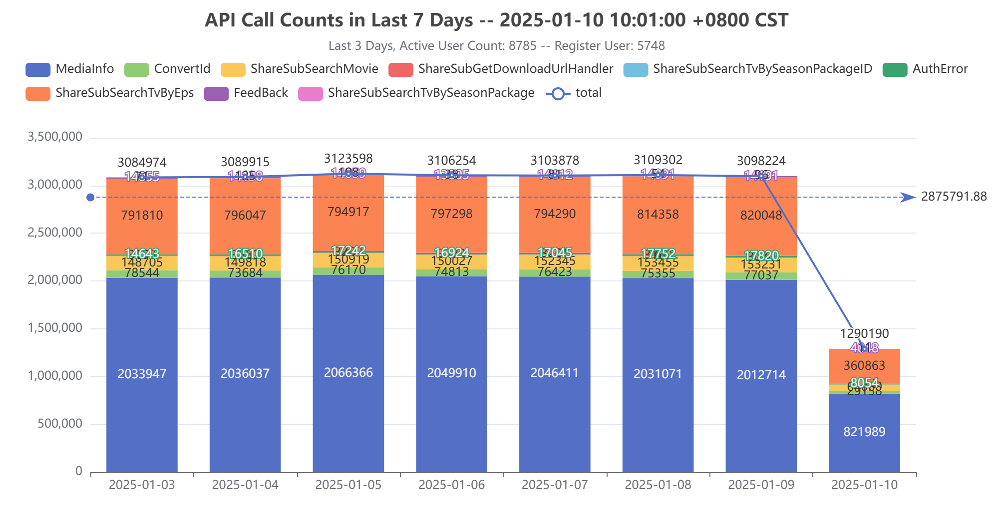
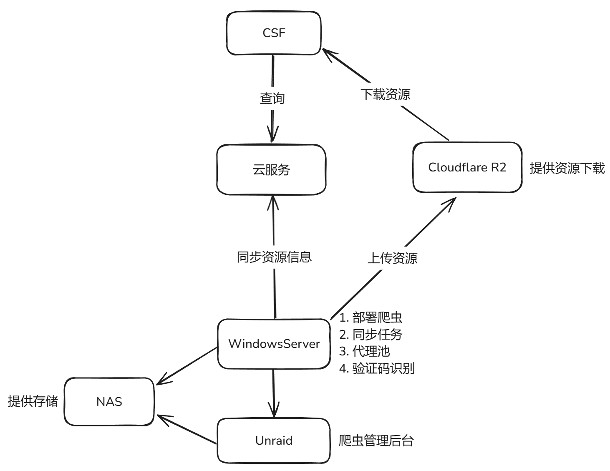
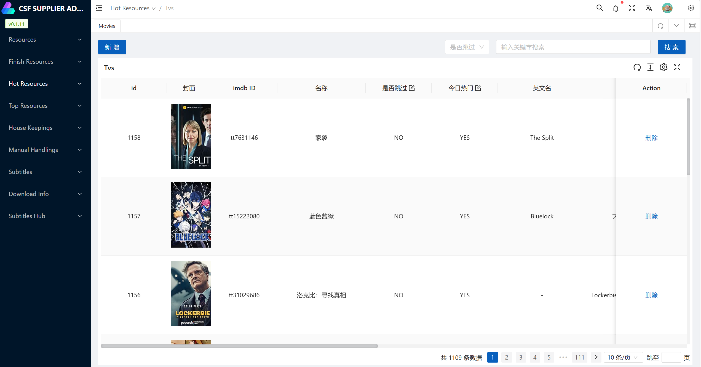

## 后会有期

## 0. 前言

因为工作内容的变动，被折腾了两年（23 - 24年），期间为这个项目后续打算做的一些功能咨询了律师，哪怕是用爱发电，也是有较大风险的（详细咨询的内容，应该不合适直接放出来）。25 年又接到通知，工作内容再次调整，业余时间应该更加不确定。

## 1. 停止维护

公用服务器将于 25 年 5 月 10 日到期，服务于本项目的云端接口将下线。

一旦云服务器关闭后，CSF 主程序也将无法正常使用。

> 评估过把 CSF 主程序剥离云服务器的代价，是个体力活，可就是抽不出时间。
>
> 也评估过项目交接的问题，这个项目都是从零拼凑起来，现学现卖，并不容易理解和阅读。
>
> 项目中有一些工具不适合公开，比如：代理池、爬虫（之前公开过，严重影响字幕站点）。

## 2. 项目总结

### 2.1 项目架构

在此给这个项目来一个整体的总结，记录一下做了什么，或许多年后回来看看还能回忆起些什么。

主要涉及到：

* 主程序维护
* 服务器维护
* 爬虫维护
* 代理池维护

然后就是整体系统的架构：

其实最近 1 年多维护的也就是爬虫，只要一些技术不公开，就不会有“对抗升级”，并且有代理池所以几乎是“无感”就能够完成爬虫任务。

### 2.2 项目缺陷

1. 严重依赖 IMDB ID，进行资源搜索；
2. IMDB 和 TMDB ID 之间转换可能会变化；
3. CSF 过于强调“管理”字幕的相关功能，导致臃肿；

## 3. 感谢

感谢支持这个项目的所有人。祝各位今后一切顺利。

也许以后还有机会再见。

也许还有几个月的缓冲期，会留下点什么。

总之，祝好。